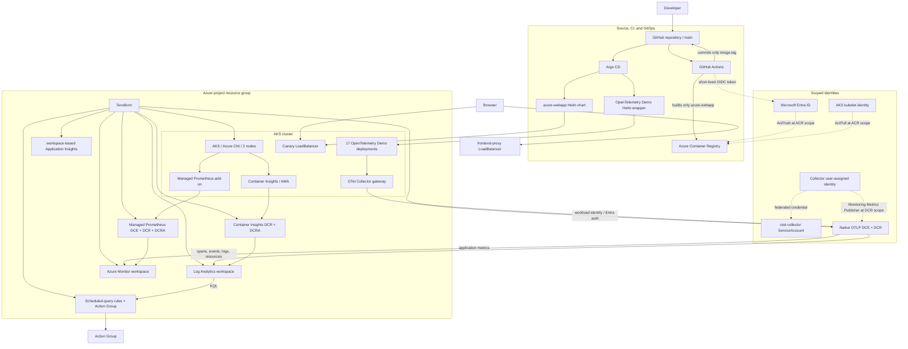

# Azure AKS GitOps CI/CD & Observability

An evidence-led Azure Kubernetes Service (AKS) project that uses Terraform for
infrastructure, GitHub Actions with Azure OpenID Connect (OIDC) for a small
application's immutable image promotion, and Argo CD for Kubernetes
reconciliation.

The pinned official OpenTelemetry Demo is the primary workload in the
`otel-demo` namespace. The existing `azure-webapp` remains a small CI → ACR →
GitOps canary: GitHub Actions builds and promotes only that application's
SHA-tagged image. Argo CD deploys both Helm sources; the demo's upstream images
are chart-pinned and are not built by this repository's CI workflow.

## Overview

The project keeps a clear ownership boundary:

- Terraform owns Azure resources plus the in-cluster namespace, collector
  ServiceAccount, and non-secret Azure OTLP endpoint ConfigMap.
- GitHub Actions owns the `azure-webapp` image build and the one-field Git
  promotion of its immutable tag.
- Argo CD owns both Helm releases and continuously reconciles desired state.
- Azure Monitor owns the production observability backends; no self-hosted
  Prometheus, Grafana, Jaeger, OpenSearch, Loki, Tempo, or similar backend is
  running in the cluster.

The complete observed validation matrix is in
[`docs/codex/03-VALIDATION.md`](docs/codex/03-VALIDATION.md).

## Architecture



### Observability paths

| Path | Flow | Purpose |
| --- | --- | --- |
| Platform logs and alerts | AKS → Container Insights/AMA → DCR/DCRA → Log Analytics → KQL → Action Group | Kubernetes inventory, container/platform logs, and scheduled-query alerts |
| Kubernetes metrics | AKS Managed Prometheus add-on → managed Prometheus DCE/DCR/DCRA → Azure Monitor workspace → PromQL | Node, pod, workload, and cluster metrics |
| Application telemetry | OTel Demo → Collector → workload identity → native OTLP DCE/DCR → Log Analytics/Azure Monitor workspace, with workspace-based Application Insights | Distributed spans, events, logs, error signals, and application metrics |

The native OTLP route stores observed trace and log data in the Log Analytics
`OTelSpans`, `OTelEvents`, `OTelLogs`, and `OTelResources` tables. It should
not be validated through the classical `AppRequests`/`AppDependencies` tables,
which are intentionally not the observed ingestion target for this route.

## Capacity guardrail

The live Central India subscription permits two `Standard_D2s_v5` nodes (four
DSv5 vCPUs total) and the cluster has 60 pod slots. The migration was validated
with 59 running pods. The wrapper therefore disables five ancillary demo
components—`accounting`, `ad`, `fraud-detection`, `image-provider`, and
`telemetry-docs`—while retaining the storefront, checkout, messaging, load
generator, Collector, and multi-language paths. Do not add replicas or an
in-cluster observability backend until quota/capacity increases.

## Technology stack

| Area | Technology |
| --- | --- |
| Cloud and infrastructure as code | Microsoft Azure, Terraform, AzureRM |
| Kubernetes and registry | AKS, Azure CNI, ACR, Docker |
| CI and identity | GitHub Actions, GitHub OIDC, Microsoft Entra ID |
| Desired state and delivery | Git, Helm, Argo CD |
| Platform observability | Azure Monitor, Container Insights, Log Analytics, KQL, Action Groups |
| Application telemetry | OpenTelemetry Demo, OpenTelemetry Collector Contrib, native Azure OTLP ingestion |
| Metrics | Azure Monitor managed Prometheus and PromQL |

## Repository structure

```text
.
├── .github/workflows/deploy-aks.yml       # build/push/promote azure-webapp only
├── app/                                   # small CI-to-GitOps canary source
├── argocd/
│   ├── azure-webapp-application.yaml
│   └── opentelemetry-demo-application.yaml
├── helm/
│   ├── azure-webapp/
│   └── opentelemetry-demo/                # wrapper around pinned upstream demo
├── modules/
│   ├── application_insights/
│   ├── container_insights/
│   ├── managed_prometheus/
│   ├── otel_cluster_config/
│   ├── otel_ingestion/
│   └── ...
├── docs/
│   ├── codex/                             # audit, plans, decisions, evidence, handoff
│   └── screenshots/                       # fresh owner-capture checklist
├── main.tf
├── providers.tf
├── variables.tf
└── terraform.tfvars.example
```

## Infrastructure with Terraform

Terraform creates the resource group, VNet/subnet, AKS, ACR, Log Analytics
workspace, Azure Monitor workspace, workspace-based Application Insights,
Container Insights DCR/DCRA, managed Prometheus DCE/DCR/DCRA, native OTLP
DCE/DCR, alerting resources, workload identity/RBAC, and optional Azure
Managed Grafana. Azure Managed Grafana is disabled by default because its
Standard tier has recurring cost.

The native OTLP DCR is a narrow ARM template deployment because the pinned
AzureRM provider cannot model its direct OTLP data-source fields and Application
Insights reference. Everything else remains AzureRM-managed. The collector has
no connection string or instrumentation key: it exchanges its Kubernetes
workload identity for an Entra token and uses DCR-scoped RBAC.

Terraform's Kubernetes provider owns only the native-OTLP handoff objects, so
it requires a dedicated AKS kubeconfig at `kubeconfig_path`. Never use the
default kubeconfig; in this environment it points at an unrelated cluster.

## CI-to-GitOps delivery

1. A change under `app/` starts GitHub Actions on `main`.
2. The workflow uses a short-lived OIDC token, builds
   `azure-webapp:<source-sha-7>`, and pushes it to ACR.
3. CI commits only `helm/azure-webapp/values.yaml:image.tag`.
4. Argo CD observes Git and reconciles the canary chart and the independent
   OpenTelemetry Demo wrapper.
5. CI never obtains AKS credentials or runs `kubectl`, Helm, or an Argo sync.

The first canary delivery proved the OIDC login, image push, one-field Git
promotion, Argo synchronization, public response, and Argo self-heal. The OTel
Demo deployment is independently reconciled by its own Argo Application.

## OpenTelemetry Demo and native Azure OTLP

[`helm/opentelemetry-demo`](helm/opentelemetry-demo) pins upstream
`opentelemetry-demo` chart `0.41.0` and replaces its local observability
backends with an OpenTelemetry Collector Contrib gateway. Jaeger, Prometheus,
Grafana, and OpenSearch are disabled. The `frontend-proxy` service is the
demo's public entry point and the built-in load generator continuously provides
safe demonstration traffic.

The Collector receives application OTLP on ports 4317/4318, enriches it with
Kubernetes metadata, and sends it to Azure through the native OTLP HTTP
endpoints. The DCR's detailed `Microsoft-OTel-*` data-flow names differ from
the case-sensitive aggregate request URLs `Microsoft-OTLP-Traces` and
`Microsoft-OTLP-Logs`; metrics use `Custom-Metrics-Otel`. This distinction is
required by the native Azure ingestion contract. See Microsoft's
[OpenTelemetry Collector ingestion guidance](https://learn.microsoft.com/en-us/azure/azure-monitor/containers/opentelemetry-protocol-ingestion).

Changing a Terraform-owned endpoint ConfigMap bumps a chart annotation so Argo
rolls the Collector and it reloads the non-secret environment configuration.

## Managed Prometheus

AKS Managed Prometheus is enabled through a dedicated Azure Monitor workspace,
DCE, DCR, and AKS DCR association. PromQL queries returned current demo
metrics, including `{__name__="demo.payment.transactions"}` with
`service.name=payment` and `k8s.namespace.name=otel-demo`. Dotted metric names
must be selected with the `__name__` matcher in PromQL.

The prior `kube-prometheus-stack` was a successful v1 baseline but was removed
after the managed path was validated. Its Prometheus Operator CRDs remain
intentionally; no Helm release or running `monitoring` workload remains.

## Container Insights and alerting

Container Insights continues to provide Kubernetes inventory and platform logs
to the existing Log Analytics workspace. Its Terraform-managed DCR and
`ContainerInsightsExtension` association are required for managed-identity
onboarding. Current `KubePodInventory` and `KubeNodeInventory` records support
the three enabled scheduled-query rules:

- node not ready;
- failed pod or CrashLoopBackOff;
- recent container restart-count increase.

A disposable failed pod was observed in KQL, fired the Sev2 rule, and sent the
configured Action Group email. The test pod was deleted afterward.

## Validation

Only observed results are marked as passing. The current highlights are:

| Area | Observed evidence | Status |
| --- | --- | --- |
| Terraform | format/validate and post-migration no-change plan pass | PASS |
| Argo OTel deployment | 17 demo deployments Ready; Application Synced/Healthy | PASS |
| Primary workload | `frontend-proxy` LoadBalancer returned HTTP 200 | PASS |
| Managed Prometheus | current `otel-demo` payment and HTTP metrics returned by PromQL | PASS |
| Native OTLP | current spans, events, logs, and resources observed in `OTel*` tables | PASS |
| Error telemetry | a brief, restored payment-failure scenario produced error spans and failure logs | PASS |
| Legacy self-hosted metrics | `kube-prometheus-stack` release removed; CRDs retained | PASS |
| Fresh screenshots | owner-captured evidence checklist exists | PENDING |

See [`docs/codex/03-VALIDATION.md`](docs/codex/03-VALIDATION.md) for exact
commands, timestamps, and caveats.

## Deployment guide

Prerequisites: an Azure subscription, Azure CLI, Terraform, Helm, kubectl,
Docker, GitHub CLI, a repository administrator, and an Action Group recipient
stored only in ignored local input.

1. Create a dedicated Azure Storage backend and local ignored `backend.hcl`
   from [`backend.hcl.example`](backend.hcl.example). Use Entra/Azure CLI
   authentication; never store a storage key in Git.
2. Copy [`terraform.tfvars.example`](terraform.tfvars.example) to ignored
   `terraform.tfvars`, set supported values locally, and initialize Terraform.
   Bootstrap AKS before applying the Kubernetes handoff resources, then obtain
   credentials in a dedicated file and complete the normal reviewed apply:

   ```bash
   terraform init -reconfigure -backend-config=backend.hcl
   terraform fmt -check -recursive
   terraform validate

   # Bootstrap the AKS dependency graph once, then create the dedicated file.
   terraform apply -target=module.aks
   PROJECT_KUBECONFIG=/tmp/azure-aks-gitops-observability.kubeconfig
   az aks get-credentials --resource-group <resource-group> --name <aks-name> \
     --file "$PROJECT_KUBECONFIG"

   terraform plan -out=tfplan
   terraform apply tfplan
   ```

   Review each plan before applying it; the targeted bootstrap is solely to
   make the AKS API available to Terraform's Kubernetes provider.
3. Configure the dedicated Entra CI application and main-branch GitHub
   federation. Grant only `AcrPush` at the created ACR scope and configure the
   documented `AZURE_*` GitHub secrets plus ACR variables without recording
   their values in Git.
4. Install Argo CD in `argocd`, then apply both Argo **Application** manifests
   after Terraform has created the `otel-demo` namespace and handoff objects:

   ```bash
   kubectl --kubeconfig "$PROJECT_KUBECONFIG" apply \
     -f argocd/azure-webapp-application.yaml
   kubectl --kubeconfig "$PROJECT_KUBECONFIG" apply \
     -f argocd/opentelemetry-demo-application.yaml
   ```

5. Push a harmless change under `app/` to validate the canary pipeline, then
   verify Argo health, both LoadBalancer responses, Container Insights, native
   `OTel*` table data, and managed-Prometheus PromQL results.

## Cleanup

Do not destroy the environment while evidence capture or documentation is
unfinished. After explicit approval, remove GitOps workloads before Argo and
then review Terraform destruction:

```bash
kubectl --kubeconfig "$PROJECT_KUBECONFIG" delete application azure-webapp \
  --namespace argocd
kubectl --kubeconfig "$PROJECT_KUBECONFIG" delete application opentelemetry-demo \
  --namespace argocd
helm uninstall argocd --namespace argocd

terraform plan -destroy -out=destroy.tfplan
terraform show -no-color destroy.tfplan
terraform apply destroy.tfplan
```

The remote Terraform state backend is deliberately outside the project
configuration. Retain its resource group, storage account, and container until
state recovery is no longer needed; delete it only under separate explicit
approval.

## Limitations

- This is a deliberately narrow DevOps demonstration, not a multi-environment
  production platform.
- The primary workload and canary use public LoadBalancer Services; no ingress,
  custom domain, TLS, private AKS/ACR, or network policy was added.
- Azure Managed Grafana is available as an optional Terraform feature but is
  not enabled in the validated environment.
- Fresh screenshots are owner-captured evidence, not a substitute for the
  observed command/API results recorded in the validation matrix.
- Resource sizing and Log Analytics retention should be reassessed for a real
  workload.

## Credits / upstream reference

This repository adapts
[rambabu-eng/azure-aks-terraform-cicd-monitoring](https://github.com/rambabu-eng/azure-aks-terraform-cicd-monitoring).
Existing upstream licensing and attribution are preserved.
