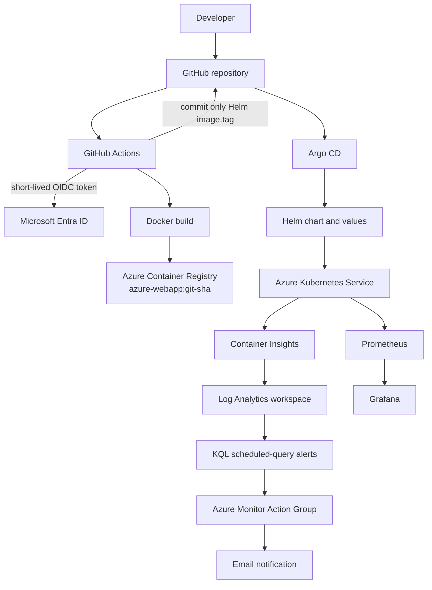

# Azure AKS GitOps CI/CD & Observability

An evidence-led DevOps project that provisions an Azure Kubernetes Service (AKS) environment with Terraform, builds immutable container images through GitHub Actions and Azure OpenID Connect (OIDC), promotes the image tag through Git, and lets Argo CD deploy and reconcile the Helm chart. Azure Monitor/Container Insights and Prometheus/Grafana provide complementary Kubernetes observability paths.

The active application deployment model is **Helm rendered by Argo CD**. GitHub Actions does not obtain AKS credentials or deploy application resources.

## Overview

The project is deliberately small: one AKS cluster, one `azure-webapp` workload, one Azure Container Registry (ACR), three Azure Monitor scheduled-query rules, and an in-cluster `kube-prometheus-stack` installation. It demonstrates clear ownership boundaries and records the validation evidence in [`docs/codex/03-VALIDATION.md`](docs/codex/03-VALIDATION.md).

## Architecture



## Problem / Goal

Manual infrastructure setup, long-lived cloud credentials, direct CI-to-cluster deployment, mutable image tags, and unobserved configuration drift make a small Kubernetes delivery path hard to audit. This project demonstrates a narrower alternative:

- Terraform describes the Azure infrastructure and monitoring configuration.
- GitHub Actions authenticates to Azure without a stored client secret, builds a SHA-tagged image, and commits the desired image tag.
- Argo CD reads that desired state from Git, deploys the Helm chart, and self-heals live drift.
- Azure Monitor and Prometheus/Grafana expose cluster and workload telemetry through different, complementary tools.

## Technology Stack

| Area | Technology |
| --- | --- |
| Cloud and infrastructure as code | Microsoft Azure, Terraform, AzureRM |
| Kubernetes and registry | AKS, Azure CNI, ACR, Docker |
| CI and identity | GitHub Actions, GitHub OIDC, Microsoft Entra ID |
| Desired state and delivery | Git, Helm, Argo CD |
| Azure-native observability | Azure Monitor, Container Insights, Log Analytics, KQL, Action Groups |
| Kubernetes metrics | kube-prometheus-stack, Prometheus, Grafana |

## Repository Structure

```text
.
├── .github/workflows/deploy-aks.yml       # build, push, and GitOps promotion
├── app/                                   # intentionally small static workload
├── argocd/azure-webapp-application.yaml   # Argo CD Application
├── helm/azure-webapp/                     # sole application deployment source
├── modules/
│   ├── acr/
│   ├── aks/
│   ├── alerts/
│   ├── container_insights/
│   ├── monitoring/
│   ├── network/
│   └── resource_group/
├── docs/
│   ├── codex/                             # audit, plan, decisions, evidence, handoff
│   ├── screenshots/                       # fresh owner-capture checklist
│   ├── RESUME.md
│   └── INTERVIEW-PREP.md
├── main.tf
├── providers.tf
├── variables.tf
├── outputs.tf
├── backend.hcl.example
└── terraform.tfvars.example
```

## Infrastructure with Terraform

Terraform creates the project resource group, virtual network and AKS subnet, ACR, AKS, Log Analytics workspace, action group, scheduled-query alerts, and the least-privilege role assignments needed by AKS. The Container Insights module manages both the data collection rule (DCR) and its AKS association, which is required for the managed-identity monitoring configuration used here.

State is deliberately not coupled to an upstream or personal storage account. The root configuration contains an empty AzureRM backend, [`backend.hcl.example`](backend.hcl.example) documents placeholders, and the real `backend.hcl` is ignored. The live backend uses Azure CLI/Entra authentication rather than a storage key.

The provisioned environment has two `Standard_D2s_v5` worker nodes, Azure CNI networking, a Basic ACR with admin access disabled, and 30-day Log Analytics retention. Exact live resource names and current status are in [`docs/codex/02-PROJECT-STATUS.md`](docs/codex/02-PROJECT-STATUS.md).

## GitHub Actions CI

[`deploy-aks.yml`](.github/workflows/deploy-aks.yml) is intentionally a CI-and-promotion workflow:

1. Checks out a source change.
2. Logs into Azure with GitHub OIDC.
3. Builds and pushes `azure-webapp:<first-7-source-sha>` to ACR.
4. Changes only `helm/azure-webapp/values.yaml:image.tag`.
5. Commits the desired-state update as `github-actions[bot]` and stops.

It has no `az aks get-credentials`, `kubectl`, Helm application release, or Argo sync step. The first live validation built and pushed `azure-webapp:9d37a77`; bot commit `751d2c4` changed only the intended Helm tag.

## Passwordless Azure OIDC

The repository uses one dedicated Microsoft Entra application/service principal with a GitHub main-branch federated credential. Its subject is derived from GitHub's live OIDC subject customization endpoint rather than hard-coding a legacy repository-name pattern. GitHub stores only the standard identifiers as Actions secrets:

- `AZURE_CLIENT_ID`
- `AZURE_TENANT_ID`
- `AZURE_SUBSCRIPTION_ID`

The service principal has `AcrPush` at the project ACR scope only. It has no client secret, no routine AKS administrator permission, and no subscription-wide Contributor role. See the [GitHub OIDC documentation](https://docs.github.com/en/actions/concepts/security/openid-connect) and [Microsoft workload identity federation guidance](https://learn.microsoft.com/entra/workload-id/workload-identity-federation-create-trust).

## Azure Container Registry

ACR stores the immutable image that CI publishes. Its repository is the sole `image.repository` value in [`helm/azure-webapp/values.yaml`](helm/azure-webapp/values.yaml); the tag is a seven-character source SHA, not `latest`.

AKS pulls from the registry through an ACR-scoped `AcrPull` assignment for the kubelet identity. ACR admin authentication remains disabled. The first validated artifact was `azure-webapp:9d37a77`, with its digest recorded in the live status/evidence documentation.

## GitOps Delivery

Git is the promotion boundary. An application-source commit produces an ACR image, and the CI bot then commits the matching immutable tag into Helm values. Argo CD observes the Git revision and reconciles it to AKS. This makes the source SHA, ACR tag/digest, promotion commit, and Argo revision traceable without giving CI Kubernetes deployment ownership.

The first delivery validated this sequence end to end: GitHub Actions OIDC login, image build/push, one-field desired-state commit, Argo synchronization, two Ready application pods, and a successful response through the LoadBalancer Service.

## Helm

The Helm chart in [`helm/azure-webapp`](helm/azure-webapp) renders the `azure-webapp` Deployment and LoadBalancer Service. Its `values.yaml` is the single source of image configuration:

```yaml
image:
  repository: <project-acr>.azurecr.io/azure-webapp
  tag: <git-sha>
  pullPolicy: IfNotPresent
```

Raw Kubernetes application manifests were retired after the chart was verified to render the equivalent active resources. Do not add a second direct-apply deployment path.

## Argo CD

Argo CD is installed with the official Helm chart in the `argocd` namespace. The [`azure-webapp` Application](argocd/azure-webapp-application.yaml) points to this fork's `main` branch and the Helm chart path, with automated sync, prune, and `selfHeal` enabled. It does not override Helm image values.

The live Application reached `Synced` and `Healthy`. A controlled drift test scaled the Deployment from two replicas to four; Argo reported it out of sync and restored the Git-defined two replicas in 28 seconds without a Git change. See the [Argo CD installation guide](https://argo-cd.readthedocs.io/en/stable/operator-manual/installation/).

## Azure Monitor

Terraform creates one Action Group and three enabled scheduled-query rules:

- node not ready;
- failed pod or CrashLoopBackOff;
- recent container restart-count increase.

Each live rule was inspected with a five-minute evaluation frequency and a 15-minute query window. The recipient address is intentionally local-only and never documented.

## Container Insights

AKS uses managed-identity authentication for Container Insights. During validation, the add-on pods were healthy but the required DCR and DCR association were absent, so no `KubePodInventory` records arrived. The Terraform-managed correction created the standard DCR and its `ContainerInsightsExtension` AKS association as two additions, without altering the workload or alert rules.

The DCR is now `Succeeded`, includes the pod/node/container streams required by the queries, and `KubePodInventory` and `KubeNodeInventory` contain current records. This follows Microsoft's guidance that managed-identity Container Insights onboarding needs both a DCR and DCR association; data can take time to appear after reconfiguration. [Microsoft troubleshooting guidance](https://learn.microsoft.com/azure/azure-monitor/containers/container-insights-troubleshoot)

## Log Analytics / KQL

The live workspace records both current pod inventory and Ready node inventory. The following schema-appropriate query was validated against the deployed workspace:

```kusto
KubePodInventory
| where TimeGenerated > ago(30m)
| project TimeGenerated, Namespace, Name, PodStatus,
          ContainerStatus, ContainerStatusReason, ContainerRestartCount
| top 20 by TimeGenerated desc
```

The corresponding node query projects `ClusterName`, `Computer`, and `Status` from `KubeNodeInventory`. KQL alert conditions in [`modules/alerts/main.tf`](modules/alerts/main.tf) use those same live table semantics, including `ContainerStatusReason` for CrashLoopBackOff and a time-window restart delta rather than a lifetime counter.

## Alerting

The alert configuration is present and enabled. The controlled `ci-alert-test` failed at 08:57:05 IST, appeared in `KubePodInventory` as `PodStatus=Failed` / `ContainerStatusReason=Error`, and produced its first real Sev2 Log Alerts V2 instance at 08:58:47 IST. Azure Alert Management recorded four fired instances for the failed-pod rule before the disposable pod was deleted. This validates Kubernetes pod failure → Container Insights → Log Analytics/KQL → scheduled-query alert. Action Group email delivery still requires the recipient's confirmation and is never inferred from configuration alone.

## Prometheus & Grafana

`kube-prometheus-stack` is installed in the `monitoring` namespace rather than Terraform-managed. The baseline validation found all relevant components Running, Prometheus healthy with 18/18 active targets, an application replica metric, and Grafana healthy with 29 supplied dashboards. Grafana is intentionally accessed through a local port-forward; no ingress, TLS, or custom application dashboard was added.

These are Kubernetes infrastructure metrics. The application does not claim custom business or request instrumentation.

## Validation Tests

Only observed results are marked as passing. The complete, continuously updated matrix is [`docs/codex/03-VALIDATION.md`](docs/codex/03-VALIDATION.md).

| Area | Observed evidence | Status |
| --- | --- | --- |
| Terraform | format/validate passed; reviewed base apply: 13 added, 0 changed, 0 destroyed; Container Insights correction: 2 added, 0 changed, 0 destroyed | PASS |
| AKS / ACR | two AKS nodes Ready; Basic ACR provisioned with admin disabled; SHA image present | PASS |
| OIDC and CI | real GitHub Actions OIDC login, Docker build, ACR push, and one-field GitOps promotion | PASS |
| Argo delivery | Application Synced/Healthy, two Ready pods, reachable LoadBalancer response | PASS |
| GitOps drift correction | live scale 2 → 4 → 2 restored by Argo in 28 seconds | PASS |
| Container Insights / KQL | DCR/DCRA created; current pod and node inventory records returned | PASS |
| Azure Monitor runtime alert | controlled failed pod matched KQL and produced four real Sev2 fired instances | PASS |
| Action Group email | recipient confirmation is tracked separately and is never inferred from configuration | PENDING |
| Prometheus / Grafana | 18/18 targets, workload metric, Grafana health and supplied dashboards | PASS |
| Fresh screenshots | owner-captured evidence checklist exists | PENDING |

## Failure Scenarios

- **GitOps drift:** the live Deployment was scaled from two to four replicas. Argo CD detected the difference and self-healed it back to two replicas in 28 seconds.
- **Controlled alert test:** a disposable `restartPolicy: Never` pod named `ci-alert-test` exited with code `1`, matched the failed-pod KQL condition, and produced four real Sev2 fired alert instances. It was deleted after the evidence was collected; no AKS node or production-like workload was disrupted.
- **CI succeeds but rollout fails:** CI has still promoted a concrete Git revision. Investigate the Argo Application and Kubernetes events, correct the chart/image configuration through Git, or promote a previously known-good SHA tag. Do not bypass Argo with a direct CI deployment.

## Screenshots

Inherited image files are not presented as evidence for this Azure environment. Capture the 13 exact owner screenshots in [`docs/screenshots/README.md`](docs/screenshots/README.md) after each corresponding validation result is visible. The checklist states what to show and which values to redact.

## Deployment Guide

Prerequisites: an Azure subscription, Azure CLI/Terraform/Helm/kubectl/Docker/GitHub CLI access, GitHub repository administration, and a recipient address for the Action Group stored only in ignored local input.

1. Create a dedicated Azure Storage backend and local ignored `backend.hcl` from [`backend.hcl.example`](backend.hcl.example). Use Entra/Azure CLI authentication; do not store a storage key in Git.
2. Copy [`terraform.tfvars.example`](terraform.tfvars.example) to ignored `terraform.tfvars`, set the actual supported values locally, then initialize and review the plan:

   ```bash
   terraform init -reconfigure -backend-config=backend.hcl
   terraform fmt -check -recursive
   terraform validate
   terraform plan -out=tfplan
   terraform apply tfplan
   ```

3. Configure a dedicated Entra application/service principal and a main-branch GitHub federated credential using the repository's current OIDC subject. Grant only `AcrPush` at the created ACR scope. Configure the three `AZURE_*` GitHub secrets and the `ACR_NAME`, `ACR_LOGIN_SERVER`, and `IMAGE_NAME` variables without recording their values in Git.
4. Obtain AKS credentials into a project-specific file; never overwrite an unrelated default kubeconfig:

   ```bash
   PROJECT_KUBECONFIG=/tmp/azure-aks-gitops-observability.kubeconfig
   az aks get-credentials --resource-group <resource-group> --name <aks-name> --file "$PROJECT_KUBECONFIG"
   kubectl --kubeconfig "$PROJECT_KUBECONFIG" get nodes
   ```

5. Install Argo CD in `argocd` and `kube-prometheus-stack` in `monitoring` from their current official Helm repositories. Apply only the Argo **Application** manifest after CI has produced and committed a real SHA image tag:

   ```bash
   kubectl --kubeconfig "$PROJECT_KUBECONFIG" apply -f argocd/azure-webapp-application.yaml
   ```

6. Push a harmless change under `app/`. Verify the Actions run, ACR SHA tag, bot-only Helm-tag diff, Argo sync/health, workload response, and monitoring evidence in sequence.

## Cleanup

Do not run destruction while evidence capture or documentation is unfinished. The following is the intended order after explicit approval:

```bash
# 1. Let Argo remove the application-managed workload.
kubectl --kubeconfig "$PROJECT_KUBECONFIG" delete application azure-webapp --namespace argocd

# 2. Remove in-cluster monitoring and Argo CD.
helm uninstall kube-prometheus-stack --namespace monitoring
helm uninstall argocd --namespace argocd

# 3. Review destruction before applying it. Do not run without explicit approval.
terraform plan -destroy -out=destroy.tfplan
terraform show -no-color destroy.tfplan
terraform apply destroy.tfplan
```

The Terraform state backend is intentionally outside the Terraform configuration. Retain its resource group, storage account, and state container until all project evidence is exported and no state recovery is needed. Only then, under separate explicit approval, delete the state container/storage account/resource group with Azure CLI using Entra authentication. Backend deletion is irreversible and must occur last.

## Design Decisions

The short ADRs in [`docs/codex/04-DECISIONS.md`](docs/codex/04-DECISIONS.md) explain the key choices:

- CI updates Git while Argo CD deploys and reconciles it.
- Immutable SHA tags replace `latest`.
- Helm values are the sole image source; Argo has no image override.
- GitHub OIDC and ACR-scoped RBAC replace stored client secrets and broad Azure access.
- Azure Monitor/Container Insights and Prometheus/Grafana have distinct purposes.
- Raw manifests were retired, and scope deliberately excludes HPA, ingress/TLS, private networking, Key Vault, service mesh, and extra environments.

## Limitations

- This is a deliberately narrow DevOps demonstration, not a multi-environment platform.
- It uses a public LoadBalancer Service and local Grafana port-forwarding; it does not add ingress, a custom domain, TLS, private AKS/ACR, or custom application telemetry.
- Container Insights/KQL and a fired Azure Monitor alert are validated; Action Group recipient confirmation must be recorded separately for a complete email-delivery claim.
- Fresh screenshots are owner-captured work, not substitute evidence from inherited files.
- Resource sizing and Log Analytics retention are chosen for the demonstrated environment and should be reassessed for a real workload.

## Credits / Upstream Reference

This repository is an adaptation of [rambabu-eng/azure-aks-terraform-cicd-monitoring](https://github.com/rambabu-eng/azure-aks-terraform-cicd-monitoring). The project was updated and validated in a separate Azure environment, including the CI-to-GitOps handoff, ownership-specific environment configuration, Terraform state isolation, and current observability validation. Existing upstream licensing and attribution are preserved; this work does not claim authorship of the upstream project.
