# Azure AKS GitOps & OpenTelemetry Observability Platform

An evidence-backed Azure platform that provisions AKS with Terraform, reconciles workload state through Argo CD, and turns a realistic OpenTelemetry microservice workload into Azure-native logs, traces, events, resources, metrics, alerts, and operational evidence.

**Azure • AKS • Terraform • Argo CD • Helm • GitHub Actions • OpenTelemetry • Azure Monitor • Managed Prometheus • Log Analytics**

**Navigate:**

- [Overview](#platform-at-a-glance)
- [Architecture](#architecture)
- [Infrastructure](#infrastructure-as-code)
- [GitOps](#gitops-with-argo-cd)
- [Workload](#opentelemetry-demo-workload)
- [Observability](#azure-native-observability)
- [Quick start](#quick-start)
- [Evidence](#live-evidence-index)
- [Security](#security-posture)

## Platform at a Glance

This project separates the cloud foundation, Kubernetes desired state, and application delivery concerns deliberately:

| Concern | What is implemented |
| --- | --- |
| Cloud platform | Terraform composes an Azure resource group, VNet and AKS subnet, AKS, Basic ACR, Log Analytics, Azure Monitor workspace, workspace-based Application Insights, Data Collection Rules, alerts, and identity/RBAC handoffs. |
| Kubernetes delivery | Argo CD reconciles two Helm sources from Git: the OpenTelemetry Demo in the <code>otel-demo</code> namespace and a small internal canary in <code>default</code>. |
| Workload | The pinned upstream OpenTelemetry Demo is used as a representative telemetry-producing microservice workload. This repository integrates and operates it; it does not claim authorship of the demo application. |
| Application delivery | GitHub Actions validates infrastructure/chart changes. A separate OIDC-based workflow builds only the small <code>azure-webapp</code> canary, pushes a Git-SHA tag to ACR, and commits the desired image tag back to Git. |
| Observability | Kubernetes health reaches Log Analytics through Container Insights; demo OTLP signals reach native <code>OTel*</code> tables and application metrics reach Azure Monitor workspace; Managed Prometheus is collected separately by the AKS Azure Monitor metrics add-on. |
| Evidence | Validation records and selected redacted capture images show running AKS nodes, Argo health, storefront traffic, native OTel records, service analysis, a distributed trace, Managed Prometheus data, and enabled alert rules. |

## What This Project Demonstrates

- A reusable Azure Kubernetes foundation expressed as small Terraform modules rather than a one-off portal build.
- A clear control-plane boundary: Terraform provisions Azure and a few explicit Kubernetes handoff objects; Argo CD owns Helm-rendered workload state.
- GitOps reconciliation with automated sync, prune, self-heal, and namespace creation on both primary Argo CD Applications.
- Native OpenTelemetry ingestion into Azure Monitor services without operating in-cluster Jaeger, Prometheus, Grafana, or OpenSearch backends.
- A practical observability story that joins Kubernetes health, application traces/logs/events/resources, and Prometheus-format application metrics.
- Scoped workload identity for the collector and short-lived GitHub-to-Azure authentication for the canary delivery workflow.

## Deployment Profiles and Evidence Boundary

The architecture is reusable, but two profiles must not be conflated:

| Profile | Intended use | Region and capacity | Demo shape |
| --- | --- | --- | --- |
| Main release | Capacity-safe reusable platform configuration | Central India; two static <code>Standard_D2s_v5</code> nodes; Azure CNI default profile | 17 retained demo deployments |
| Temporary telemetry capture | Isolated short-lived evidence run | East US; two static <code>Standard_D2s_v7</code> nodes; Azure CNI Overlay | Full 22-deployment demo variant |

> **Capture disclaimer:** Every image marked “temporary capture” below comes from the isolated East US full-telemetry environment on the <code>feature/telemetry-capture-eastus</code> branch. It validates the same Azure-native telemetry design, but its resource names, branch, VM SKU, deployment count, capacity, and public endpoint are not the Central India main release.

This distinction matters because the capture profile intentionally restored five demo components and used small, time-bounded ingestion caps to generate rich evidence. It is evidence of the design, not a claim that the main release uses the capture network mode, 22-component workload, or capture SKU.

## Live Validation Snapshot

The project is documented with both main-release validation and a dedicated temporary telemetry capture. The values below are recorded observations, not availability or performance promises.

| Scope | Recorded observation | Why it matters |
| --- | --- | --- |
| Main release | Two <code>Standard_D2s_v5</code> nodes; 17 retained demo deployments Ready; 58 running pods at final verification | Demonstrates the capacity-safe primary workload profile. |
| Main release | <code>frontend-proxy</code> returned HTTP 200 on port 8080 | Confirms the public demo entry point was reachable. |
| Main release | Five-minute native query at 2026-08-24T06:25Z: 15,986 spans, 5,221 events, 5,126 logs, and 1,365 resources | Confirms Azure-native application signal ingestion. |
| Temporary capture | 2 Ready nodes, 22 Ready demo deployments, and Argo CD <code>Synced</code>/<code>Healthy</code> | Confirms the full capture profile converged before evidence collection. |
| Temporary capture | A 30-minute capture image shows non-zero <code>OTelSpans</code>, <code>OTelEvents</code>, <code>OTelLogs</code>, and <code>OTelResources</code> records | Demonstrates all native signal tables receiving fresh data. |
| Temporary capture | 17 span-producing application services and a 12-service checkout trace were observed | Demonstrates service-level and request-level correlation. |
| Temporary capture | Managed Prometheus returned <code>demo.payment.transactions</code> with payment service and currency dimensions | Demonstrates an application-specific metric, not only Kubernetes infrastructure metrics. |

The recorded observations distinguish the primary release from the temporary capture profile.

## Architecture

The platform is designed around a simple operating model: Git declares intent, Terraform creates the Azure foundation, Argo CD reconciles workloads, and Azure-native backends store and query the resulting signals.

### 1. High-Level Platform Architecture

~~~mermaid
flowchart TB
  Developer[Developer] --> Repo[Git repository]

  subgraph Delivery["Delivery and reconciliation"]
    Repo --> Validation[Validation workflow]
    Repo --> CanaryCI[Canary delivery workflow]
    CanaryCI --> ACR[Azure Container Registry]
    CanaryCI --> DesiredState[Committed image tag]
    Repo --> DesiredState
    DesiredState --> Argo[Argo CD]
  end

  subgraph Provisioning["Platform provisioning"]
    Repo --> TerraformCode[Terraform configuration]
    TerraformCode --> Operator[Terraform operator]
    Operator --> AzureRG[Azure project resource group]
  end

  subgraph AzurePlatform["Azure platform"]
    AzureRG --> AKS[AKS cluster]
    AzureRG --> Monitor[Azure Monitor resources]
    AzureRG --> Registry[ACR]

    subgraph Cluster["AKS workloads"]
      AKS --> Canary[Internal canary]
      AKS --> Demo[OpenTelemetry Demo]
      AKS --> Collector[OTel Collector gateway]
      Demo --> Collector
      Canary --> Registry
      Demo --> Registry
    end
  end

  Argo --> Canary
  Argo --> Demo
  Browser[Browser] --> PublicLB[frontend-proxy LoadBalancer]
  PublicLB --> Demo
  Collector --> Monitor
~~~

### 2. Azure Resource Topology

~~~mermaid
flowchart TB
  Subscription[Azure subscription] --> RG[Project resource group]

  subgraph Foundation["Terraform-managed Azure resources"]
    RG --> Network[VNet]
    Network --> AKSSubnet[AKS subnet]
    RG --> AKSCluster[AKS]
    AKSSubnet --> AKSCluster
    AKSCluster --> SystemPool[Static system node pool]
    AKSCluster --> K8s[Namespace and workload endpoints]

    RG --> ACRTopo[Basic ACR]
    RG --> LAW[Log Analytics workspace]
    RG --> AMW[Azure Monitor workspace]
    RG --> AppInsights[Workspace-based Application Insights]

    RG --> ContainerDCR[Container Insights DCR]
    RG --> PromDCE[Managed Prometheus DCE and DCR]
    RG --> OTelDCE[Native OTLP DCE and DCR]
    RG --> Alerts[Scheduled-query alerts]
    RG --> ActionGroup[Email Action Group]
  end

  AKSCluster --> ContainerDCR
  AKSCluster --> PromDCE
  K8s --> OTelDCE
  ContainerDCR --> LAW
  OTelDCE --> LAW
  OTelDCE --> AMW
  PromDCE --> AMW
  AppInsights -. workspace reference .-> OTelDCE
  LAW --> Alerts
  Alerts --> ActionGroup
~~~

### 3. GitOps Delivery Flow

~~~mermaid
flowchart TB
  Change[Developer change] --> GitHub[GitHub repository]

  subgraph ValidationPath["Pull request and branch validation"]
    GitHub --> Validate[validate.yml]
    Validate --> TFChecks[Terraform format and validate]
    Validate --> HelmChecks[Helm dependency build lint and render]
  end

  subgraph CanaryPath["Canary image promotion on main"]
    GitHub --> Deploy[deploy-aks.yml]
    Deploy --> GitHubOIDC[GitHub OIDC login]
    GitHubOIDC --> PushImage[Build and push azure-webapp]
    PushImage --> ACRFlow[ACR Git-SHA tag]
    PushImage --> ValuesCommit[Commit only values image tag]
    ValuesCommit --> GitHub
  end

  subgraph Reconciliation["GitOps reconciliation"]
    GitHub --> ArgoFlow[Argo CD watches desired state]
    ArgoFlow --> DemoApp[OpenTelemetry Demo Application]
    ArgoFlow --> CanaryApp[azure-webapp Application]
    DemoApp --> DemoNS[otel-demo namespace]
    CanaryApp --> DefaultNS[default namespace]
  end
~~~

The workflow validates Terraform and Helm sources; it does not run Terraform plan/apply, retrieve AKS credentials, or call Helm or kubectl against the cluster. Argo CD is deliberately the workload reconciler, while the CI workflow only promotes the canary image through Git.

### 4. Azure-Native OpenTelemetry Signal Flow

~~~mermaid
flowchart TB
  Traffic[Built-in load generator and browser traffic] --> DemoServices[OpenTelemetry Demo services]
  DemoServices --> CollectorGateway[OTel Collector gateway]

  subgraph NativeOTLP["Identity-authenticated native OTLP route"]
    CollectorGateway --> NativeDCR[Native OTLP DCR]
    AppRef[Workspace-based Application Insights] -. resource reference .-> NativeDCR
    NativeDCR --> OTelTables[Log Analytics OTel tables]
    NativeDCR --> AppMetrics[Azure Monitor workspace metrics]
    OTelTables --> Spans[OTelSpans]
    OTelTables --> Logs[OTelLogs]
    OTelTables --> Events[OTelEvents]
    OTelTables --> Resources[OTelResources]
  end

  subgraph KubernetesSignals["Kubernetes health and Prometheus route"]
    AKSSignals[AKS nodes pods and containers] --> AMA[Azure Monitor agent]
    AMA --> ContainerDCRFlow[Container Insights DCR]
    ContainerDCRFlow --> LAWFlow[Log Analytics workspace]

    AKSSignals --> PromAddon[AKS Azure Monitor metrics add-on]
    PromAddon --> PromDCRFlow[Managed Prometheus DCE and DCR]
    PromDCRFlow --> AMWFlow[Azure Monitor workspace]
  end
~~~

The native OTLP path is intentionally separate from Container Insights and Managed Prometheus. The collector sends trace, log, event, resource, and custom-metric streams through a direct-ingestion DCR; Container Insights supplies Kubernetes inventory and health signals; the AKS metrics add-on supplies the Managed Prometheus route.

### 5. Captured Services Participating in a Checkout Trace

This is a participation map, not a claimed parent/child call tree. The selected temporary-capture trace contained these twelve services under one shared trace identifier.

~~~mermaid
flowchart TB
  Trace[One captured checkout trace] --> Entry[Entry and traffic]
  Trace --> Commerce[Commerce services]
  Trace --> Support[Supporting services]

  Entry --> LoadGenerator[load-generator]
  Entry --> FrontendProxy[frontend-proxy]
  Entry --> Frontend[frontend]

  Commerce --> ProductCatalog[product-catalog]
  Commerce --> Cart[cart]
  Commerce --> Checkout[checkout]
  Commerce --> Payment[payment]

  Support --> Currency[currency]
  Support --> Shipping[shipping]
  Support --> Quote[quote]
  Support --> Flagd[flagd]
  Support --> Email[email]
~~~

### 6. Terraform Provisioning Tree

~~~mermaid
flowchart TB
  Terraform[Terraform root module] --> Core[Core foundation]
  Terraform --> Observability[Observability foundation]
  Terraform --> Identity[Identity and scoped RBAC]
  Terraform --> ClusterHandoff[In-cluster handoff objects]

  Core --> ResourceGroup[Resource group]
  Core --> Networking[VNet and AKS subnet]
  Core --> AKSProvision[AKS and system node pool]
  Core --> RegistryProvision[Basic ACR]

  Observability --> LAProvision[Log Analytics workspace]
  Observability --> AMWProvision[Azure Monitor workspace]
  Observability --> AIProvision[Application Insights]
  Observability --> CIDCRProvision[Container Insights DCR association]
  Observability --> PromProvision[Managed Prometheus DCE DCR association]
  Observability --> NativeProvision[Native OTLP DCE DCR]
  Observability --> AlertProvision[Alert rules and Action Group]

  Identity --> KubeletRBAC[AcrPull for kubelet identity]
  Identity --> NetworkRBAC[Network Contributor for AKS identity]
  Identity --> CollectorIdentity[Collector user-assigned identity]
  Identity --> Federation[Federated credential and DCR role]

  ClusterHandoff --> Namespace[otel-demo namespace]
  ClusterHandoff --> ServiceAccount[otel-collector ServiceAccount]
  ClusterHandoff --> EndpointConfig[Non-secret OTLP endpoint ConfigMap]
~~~

### 7. Identity and Access Flow

~~~mermaid
flowchart TB
  subgraph DeliveryIdentity["Canary delivery identity"]
    Actions[GitHub Actions] --> OIDC[Short-lived OIDC assertion]
    OIDC --> Entra[Microsoft Entra ID]
    Entra --> AcrPush[AcrPush at ACR scope]
    AcrPush --> RegistryIdentity[Azure Container Registry]
  end

  subgraph ClusterIdentity["AKS and collector identities"]
    Kubelet[AKS kubelet identity] --> AcrPull[AcrPull at ACR scope]
    AcrPull --> RegistryIdentity

    AKSOIDC[AKS OIDC issuer] --> FederationIdentity[Federated credential]
    FederationIdentity --> CollectorUAMI[Collector user-assigned identity]
    CollectorSA[otel-collector ServiceAccount] --> FederationIdentity
    CollectorUAMI --> MetricsRole[Monitoring Metrics Publisher at native DCR scope]
    MetricsRole --> NativeDCRIdentity[Native OTLP DCR]

    AKSControl[AKS control-plane identity] --> NetworkRole[Network Contributor at AKS subnet scope]
  end
~~~

GitHub-to-Azure OIDC is configured outside Terraform and used by the canary workflow. Terraform does configure the collector federated credential and narrowly scopes its metrics-publisher role to the native OTLP DCR. ACR admin access is disabled. The repository does not store a static Application Insights connection string or instrumentation key in Helm values.

### 8. Observability Responsibility Map

~~~mermaid
flowchart TB
  Operations[Platform operations] --> Infrastructure[Infrastructure health]
  Operations --> Application[Application telemetry]
  Operations --> Guardrails[Operational guardrails]

  Infrastructure --> Nodes[AKS nodes]
  Infrastructure --> Pods[Pods and inventory]
  Infrastructure --> Containers[Container logs and performance]
  Infrastructure --> ContainerInsights[Container Insights to Log Analytics]

  Application --> Traces[Traces]
  Application --> LogsApp[Logs]
  Application --> EventsApp[Events]
  Application --> ResourcesApp[Resource metadata]
  Application --> MetricsApp[Application metrics]
  Traces --> OTelTablesMap[Native OTel tables]
  LogsApp --> OTelTablesMap
  EventsApp --> OTelTablesMap
  ResourcesApp --> OTelTablesMap
  MetricsApp --> ManagedProm[Managed Prometheus and Azure Monitor workspace]

  Guardrails --> AlertRulesMap[Node pod and restart alert rules]
  Guardrails --> Cap[Temporary capture daily caps]
  Guardrails --> HealthChecks[Readiness and query checks]
~~~

## Technology Stack

| Layer | Technology | Purpose in this repository |
| --- | --- | --- |
| Cloud | Microsoft Azure | Resource group, network, registry, AKS, identity, and monitoring services |
| Infrastructure as Code | Terraform 1.6 or newer | Modular provisioning and environment configuration |
| Kubernetes | Azure Kubernetes Service | Runtime for the demo and internal canary |
| Networking | Azure CNI and Standard Load Balancer | Pod networking and public demo exposure |
| Registry | Azure Container Registry Basic | Stores the Git-SHA-tagged canary image |
| Packaging | Helm | Packages the canary and OpenTelemetry Demo wrapper |
| GitOps | Argo CD | Reconciles Helm desired state to AKS |
| CI | GitHub Actions | Validates Terraform/Helm and promotes the canary image through Git |
| Telemetry | OpenTelemetry Collector Contrib | Forwards workload OTLP signals through Azure-native ingestion |
| Logs and traces | Log Analytics | Stores and queries OTel tables plus Container Insights data |
| Metrics | Azure Monitor workspace and Managed Prometheus | Stores Prometheus-format metrics and supports PromQL |
| Application context | Workspace-based Application Insights | Provides the native OTLP DCR resource reference; local authentication is disabled |

## Repository Structure

~~~text
.
├── .github/workflows/
│   ├── validate.yml                         # Terraform and Helm validation
│   └── deploy-aks.yml                       # OIDC canary image promotion
├── argocd/
│   ├── azure-webapp-application.yaml        # Internal canary Application
│   ├── opentelemetry-demo-application.yaml  # Main demo Application
│   └── opentelemetry-demo-capture-application.yaml
├── app/                                     # Small nginx-based canary source
├── environments/
│   └── telemetry-capture-eastus.tfvars      # Temporary capture-only profile
├── helm/
│   ├── azure-webapp/                        # Canary chart
│   └── opentelemetry-demo/                  # Pinned upstream-demo wrapper
├── modules/
│   ├── aks/ network/ acr/                   # Azure platform components
│   ├── monitoring/ container_insights/      # Azure monitoring foundation
│   ├── managed_prometheus/ otel_ingestion/  # Metrics and direct OTLP routes
│   ├── application_insights/ alerts/        # App context and alerts
│   └── otel_cluster_config/                 # Explicit Kubernetes handoff objects
├── docs/
│   ├── phases/                              # Historical implementation notes
│   └── screenshots/                         # Curated capture images
├── backend.hcl.example                      # Ignored remote-state configuration template
├── main.tf                                  # Module composition
├── terraform.tfvars.example                 # Safe local-input template
├── variables.tf                             # Root inputs and validation
└── README.md
~~~

## Infrastructure as Code

### Terraform Design

Terraform is the cloud-foundation control plane. The root module composes focused modules for the resource group, network, AKS, ACR, monitoring, Application Insights, Container Insights, Managed Prometheus, direct OTLP ingestion, alerts, and optional Managed Grafana.

| Area | Terraform-managed implementation | Boundary |
| --- | --- | --- |
| Network | VNet <code>10.20.0.0/16</code> and AKS subnet <code>10.20.1.0/24</code> | No NSGs, UDRs, NAT gateway, private endpoints, or network policy are declared. |
| AKS | Free tier, one static system pool, Standard Load Balancer, Azure CNI, OIDC issuer, workload identity, OMS agent, and Azure Monitor metrics add-on | No private cluster, autoscaling, zones, backup/DR, Azure RBAC integration, or authorized-IP configuration is declared. |
| Registry | Basic ACR with admin access disabled | AKS kubelet receives <code>AcrPull</code> at ACR scope. GitHub CI federation and push role are external setup, not Terraform resources. |
| Log/traces | Log Analytics, Container Insights DCR/DCRA, and direct OTLP DCE/DCR | Native workload data is validated in <code>OTel*</code> tables rather than classic <code>App*</code> tables. |
| Metrics | Azure Monitor workspace plus Managed Prometheus DCE/DCR/DCRA | Separate from both Container Insights and the direct OTLP path. |
| Application context | Workspace-based Application Insights with local authentication disabled | The native OTLP template includes its resource reference; it is not represented as an in-cluster SDK credential. |
| Alerting | One email Action Group and three scheduled-query rules | Recipient details stay local and are not published. |
| In-cluster handoff | Namespace, collector ServiceAccount, non-secret endpoint ConfigMap | Terraform does not install Argo CD or own Helm-rendered application resources. |

The native OTLP DCE/DCR is implemented through a narrow ARM template deployment because the locked AzureRM provider version cannot model the required direct-source shape and Application Insights reference. That is a targeted provider-gap workaround, not a general-purpose ARM escape hatch.

### AKS Design

The main profile uses two static <code>Standard_D2s_v5</code> nodes in Central India with the Azure CNI default profile. The capture-only profile overrides that to East US, <code>Standard_D2s_v7</code>, Azure CNI Overlay, pod CIDR <code>10.244.0.0/16</code>, and 250 maximum pods per node so the temporary 22-deployment demonstration can run within its own capacity envelope.

The workload boundary is equally intentional:

- The primary OpenTelemetry Demo runs in <code>otel-demo</code>.
- The only public workload service in the primary demo is <code>frontend-proxy</code>, exposed as a LoadBalancer on port 8080.
- The small <code>azure-webapp</code> canary is currently one replica behind a ClusterIP service on port 80; it is not the public demo entry point.
- The collector is a one-replica gateway deployment with requests of 200m CPU / 256Mi memory and limits of 500m CPU / 512Mi memory.

### Capture story: Azure foundation and cluster capacity

<table>
<tr>
<td width="50%" valign="top">
<a href="docs/screenshots/capture-02-resource-group.png">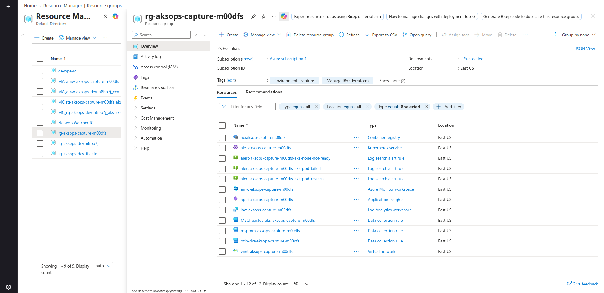</a>
 <strong>1. Terraform-provisioned Azure foundation.</strong> 
The resource inventory brings the AKS cluster, ACR, Log Analytics workspace, Azure Monitor workspace, Application Insights, Data Collection Rules, alert rules, and virtual network into one temporary East US environment.
</td>
<td width="50%" valign="top">
<a href="docs/screenshots/capture-03-aks-overview.png">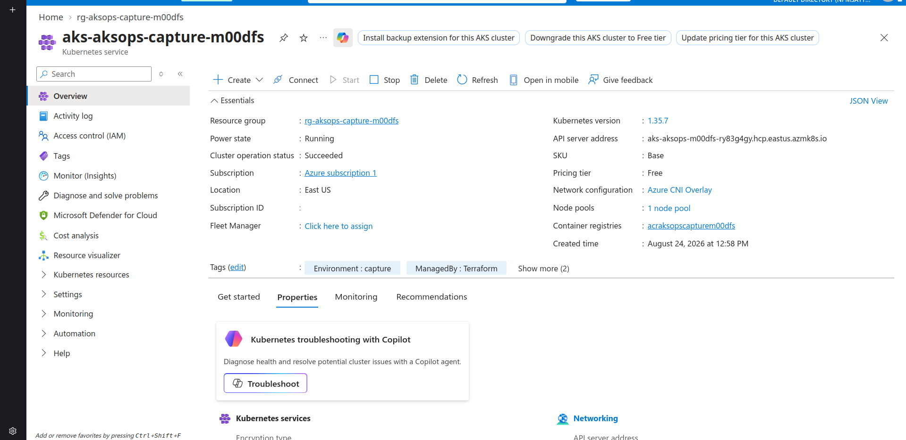</a>
 <strong>2. Running AKS control plane.</strong> 
The cluster overview confirms a completed operation, the East US location, Azure CNI Overlay, and the connected registry before workload delivery begins.
</td>
</tr>
</table>

<a href="docs/screenshots/capture-03b-node-pool.png">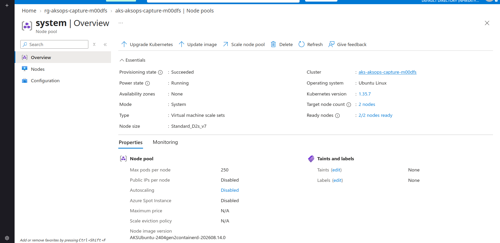</a>

*Temporary capture evidence.* **3. Two-node system pool ready.** The capture profile has its own capacity boundary: two Ready nodes on the temporary East US pool, isolated from the Central India main-release configuration.

## GitOps with Argo CD

Argo CD is the Kubernetes desired-state controller. It is not provisioned by Terraform in this repository; an operator installs Argo CD, then applies the tracked Application manifests.

| Application | Git path and destination | Reconciliation settings |
| --- | --- | --- |
| <code>opentelemetry-demo</code> | <code>helm/opentelemetry-demo</code> from <code>main</code> to <code>otel-demo</code> | Automated sync, prune, self-heal, and CreateNamespace |
| <code>azure-webapp</code> | <code>helm/azure-webapp</code> from <code>main</code> to <code>default</code> | Automated sync, prune, self-heal, and CreateNamespace |
| <code>opentelemetry-demo-capture</code> | Capture Application using the feature branch and capture values overlay | Temporary evidence environment only |

Terraform owns the <code>otel-demo</code> namespace, collector ServiceAccount, and endpoint ConfigMap because these are platform handoffs. Argo CD owns the Helm-rendered workload resources. Keeping these ownership lines explicit avoids competing reconcilers.

### Capture story: GitOps reconciliation

<a href="docs/screenshots/capture-04-argocd-application.png">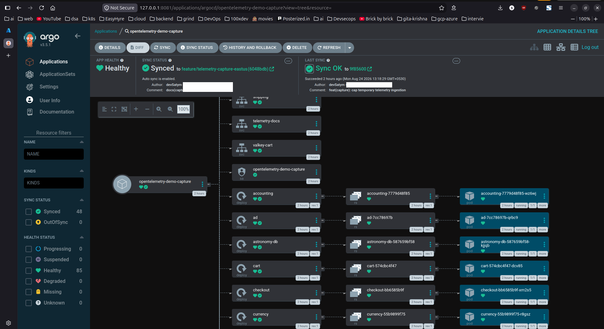</a>

*Temporary capture evidence.* **4. Argo CD convergence: Synced and Healthy.** The isolated Application has reconciled its Helm source and resource tree. This proves the GitOps control loop for the temporary profile; it does not imply that the main Application tracks the feature branch.

<strong>5. Complete desired-state-to-pod resource tree.</strong> Open the full capture to inspect every reconciled workload, Service, and healthy pod.

 
<a href="docs/screenshots/capture-04b-argocd-application.png">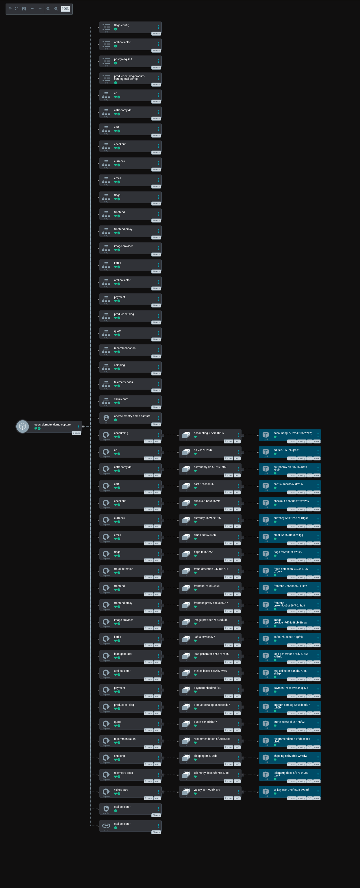</a>

## OpenTelemetry Demo Workload

The primary workload is the official OpenTelemetry Demo, also known as Astronomy Shop. It is intentionally used as an upstream representative workload because it generates realistic cross-service HTTP activity, traces, logs, events, resources, metrics, and checkout behavior. This project’s engineering contribution is the platform integration: the Azure foundation, Helm wrapper, traffic profile, collector configuration, GitOps delivery, monitoring, alerts, and validation approach.

The wrapper chart is version 0.1.0 with app version 3.0.0 and pins the official OpenTelemetry Demo Helm dependency at 0.41.0 through the committed lockfile. The base profile retains 17 deployment objects:

17 retained base deployments

 

astronomy-db, cart, checkout, currency, email, flagd, frontend, frontend-proxy, kafka, load-generator, otel-collector, payment, product-catalog, quote, recommendation, shipping, and valkey-cart.

The capture overlay restores accounting, ad, fraud-detection, image-provider, and telemetry-docs for its full 22-deployment evidence profile. Optional agent, chatbot, MCP, and OpAMP-server components remain disabled. Jaeger, in-cluster Prometheus, Grafana, and OpenSearch are disabled because Azure-native backends are the intended observability destination.

The packaged load generator supplies ongoing synthetic activity. Its effective traffic is flagd-controlled in the capture profile, where five HTTP users plus one browser user were observed; the wrapper's <code>LOAD_GENERATOR_VUS=3</code> environment value is only a fallback and is not presented here as the active traffic setting.

### Runtime readiness and public entry point

<table>
<tr>
<td width="50%" valign="top">
<a href="docs/screenshots/capture-01-terminal-readiness.png">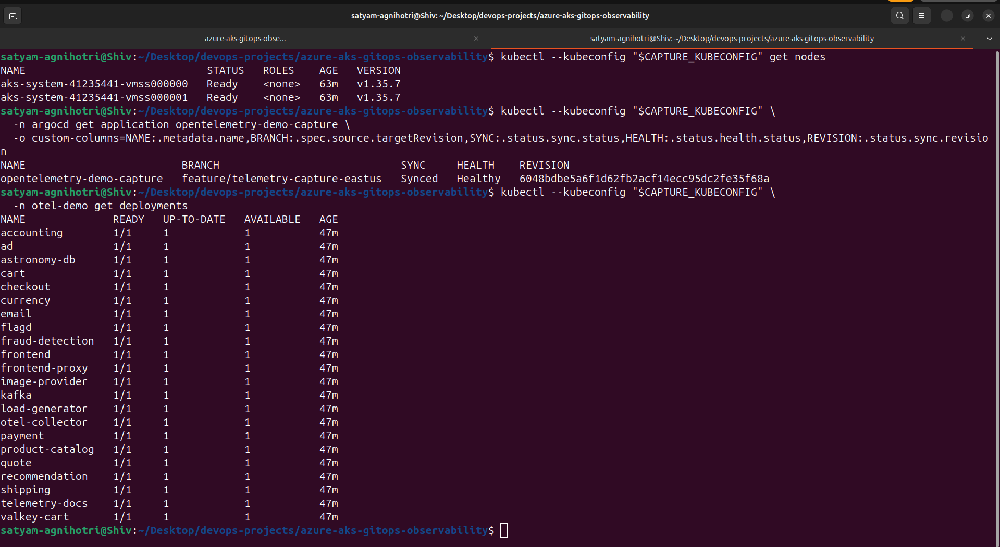</a>
 <strong>6. Runtime readiness gate.</strong> 
Independent terminal checks show two Ready nodes, a Synced and Healthy Argo CD Application, and the captured demo deployments available before public traffic is exercised.
</td>
<td width="50%" valign="top">
<a href="docs/screenshots/capture-05a-public-loadbalancer.png">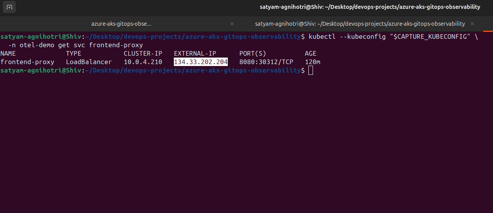</a>
 <strong>7. Public frontend entry point.</strong> 
The <code>frontend-proxy</code> LoadBalancer supplies the bridge from browser traffic to the OpenTelemetry Demo workload and its downstream telemetry path.
</td>
</tr>
</table>

### Application Journey

The controlled temporary-environment journey below turns a healthy platform into meaningful request traffic. It progresses from storefront browsing to a seeded checkout and completion, creating the application activity later visible in the traces, logs, and metrics.

<table>
<tr>
<td width="50%" valign="top">
<a href="docs/screenshots/capture-05b-storefront-home.png">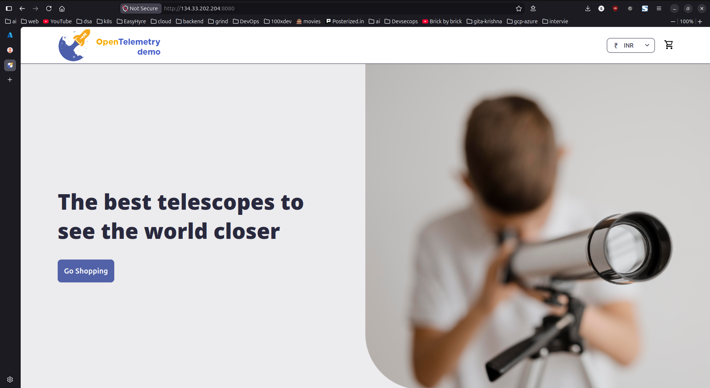</a>
 <strong>8. Storefront.</strong> 
The public demo reaches the upstream Astronomy Shop user experience through the temporary capture endpoint.
</td>
<td width="50%" valign="top">
<a href="docs/screenshots/capture-05c-product-page.png">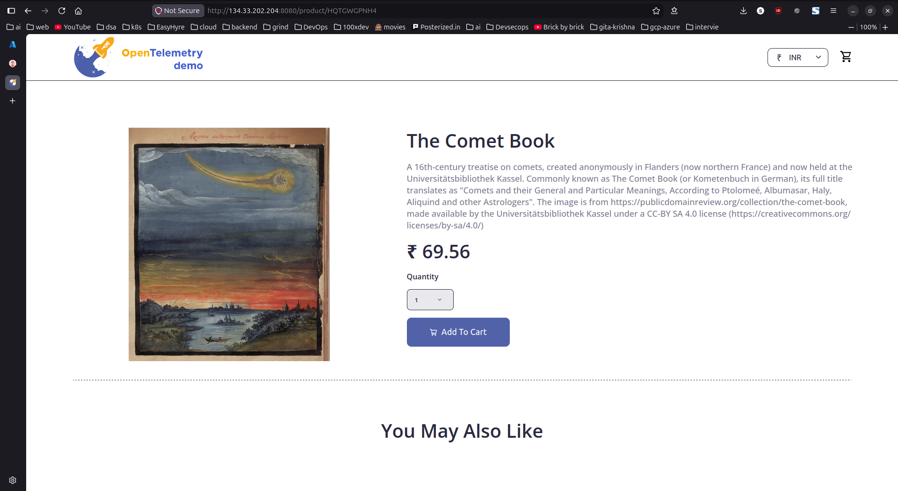</a>
 <strong>9. Product interaction.</strong> 
Browsing a product exercises the frontend and its downstream dependencies, complementing continuous synthetic load.
</td>
</tr>
<tr>
<td width="50%" valign="top">
<a href="docs/screenshots/capture-05d-cart-checkout.png">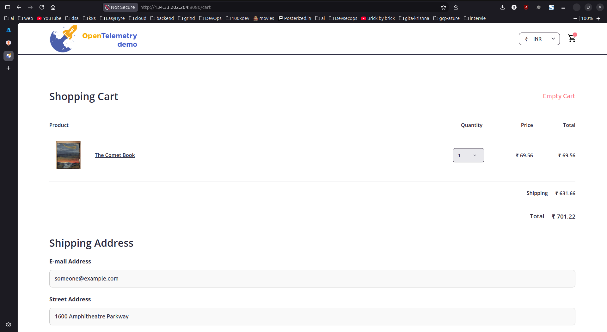</a>
 <strong>10. Sample checkout.</strong> 
The cart preserves the selected item, pricing, shipping choice, and checkout form state before the order is submitted.
</td>
<td width="50%" valign="top">
<a href="docs/screenshots/capture-05e-order-complete.png">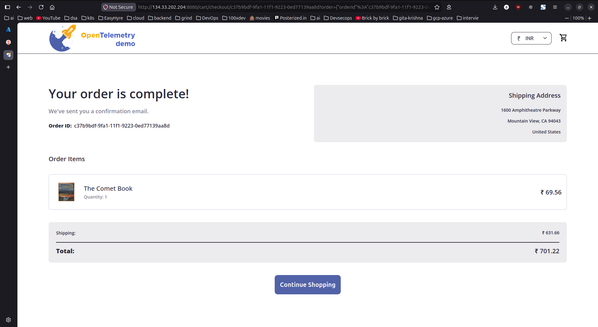</a>
 <strong>11. Order completion.</strong> 
A completed demo order confirms the customer-facing path and produces realistic cross-service traffic for the observability pipeline.
</td>
</tr>
</table>

The runtime journey is:

~~~text
Browser
  ↓
Azure LoadBalancer
  ↓
frontend-proxy
  ↓
frontend and OpenTelemetry Demo services
  ↓
OTel Collector and Azure-native telemetry backends
~~~

## Azure-Native Observability

This project intentionally separates three data paths instead of treating “monitoring” as one opaque feature:

1. **Kubernetes and container health** goes through Container Insights to Log Analytics.
2. **Application traces, logs, events, resources, and custom metrics** go from the collector through the identity-authenticated native OTLP DCR.
3. **Prometheus-format metrics** go through the AKS Azure Monitor metrics add-on to the Azure Monitor workspace.

### Kubernetes and Infrastructure Monitoring

Container Insights is configured with one-minute collection, ContainerLogV2, and namespace filtering disabled, so the DCR covers all namespaces. Its configured streams include container logs, Kubernetes events, pod/node/PV/service inventory, agent events, InsightsMetrics, container inventory, node inventory, and Perf.

<a href="docs/screenshots/capture-06-container-insights.png">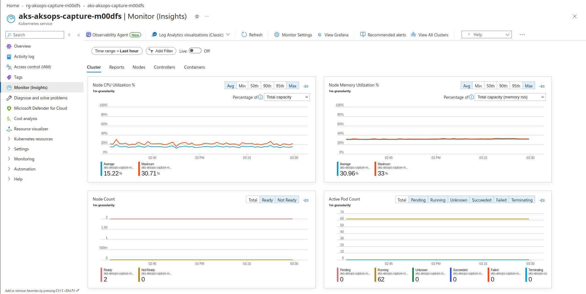</a>

*Temporary capture evidence.* **12. Kubernetes health at a glance.** Two Ready nodes and Container Insights views establish the Kubernetes-health layer that complements request-level application telemetry. Azure Managed Grafana is disabled in both profiles; the portal's generic Grafana navigation is not evidence of an enabled Managed Grafana resource.

### Native OpenTelemetry Records in Log Analytics

The collector uses workload identity and direct Azure Monitor ingestion URLs for trace/log and custom-metric streams. The Log Analytics destination is the native OpenTelemetry schema: <code>OTelSpans</code>, <code>OTelEvents</code>, <code>OTelLogs</code>, and <code>OTelResources</code>.

<a href="docs/screenshots/capture-07-native-otel-records.png">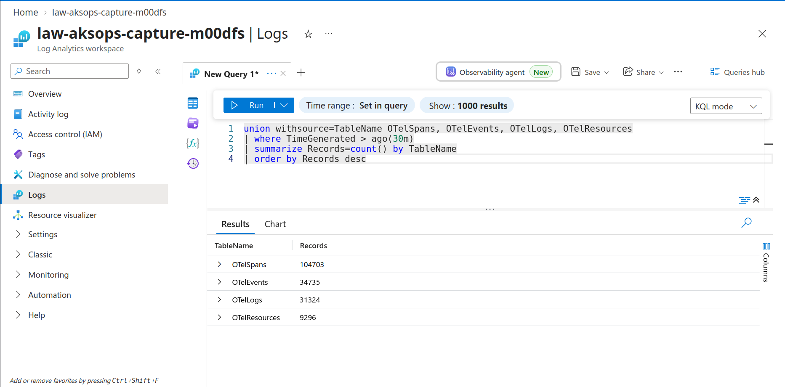</a>

*Temporary capture evidence.* **13. All four native OTel tables receiving data.** The image shows non-zero records over a 30-minute query window: 104,703 spans, 34,735 events, 31,324 logs, and 9,296 resources. Counts naturally vary with the selected time window and traffic volume.

~~~kusto
union withsource=TableName OTelSpans, OTelEvents, OTelLogs, OTelResources
| where TimeGenerated > ago(30m)
| summarize Records=count() by TableName
| order by Records desc
~~~

This is not a classic Application Insights SDK ingestion claim: the observed application records land in <code>OTel*</code> tables. Workspace-based Application Insights is part of the direct-ingestion configuration and has local authentication disabled, but classic <code>AppRequests</code>, <code>AppDependencies</code>, and related tables were expectedly empty during validation.

### Service-Level Performance

<a href="docs/screenshots/capture-08-service-performance.png">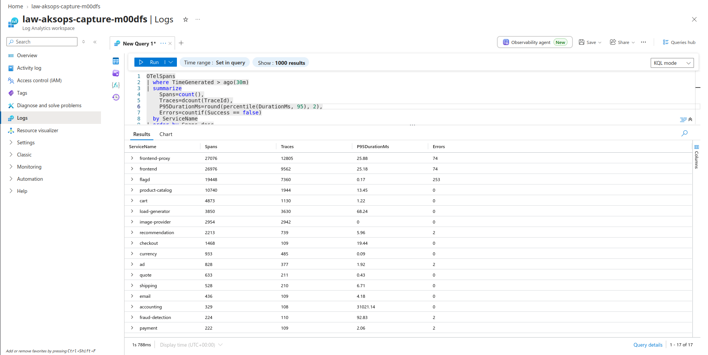</a>

*Temporary capture evidence.* **14. Per-service spans, traces, P95, and errors.** This query summarizes spans, distinct traces, P95 duration, and error count by service. Seventeen instrumented application services produced spans; several Ready workload deployments are datastores, control components, or documentation and are therefore not expected to produce application spans.

~~~kusto
OTelSpans
| where TimeGenerated > ago(30m)
| summarize
    Spans=count(),
    Traces=dcount(TraceId),
    P95DurationMs=round(percentile(DurationMs, 95), 2),
    Errors=countif(Success == false)
  by ServiceName
| order by Spans desc
~~~

### Distributed Trace Correlation

<a href="docs/screenshots/capture-09-distributed-trace.png">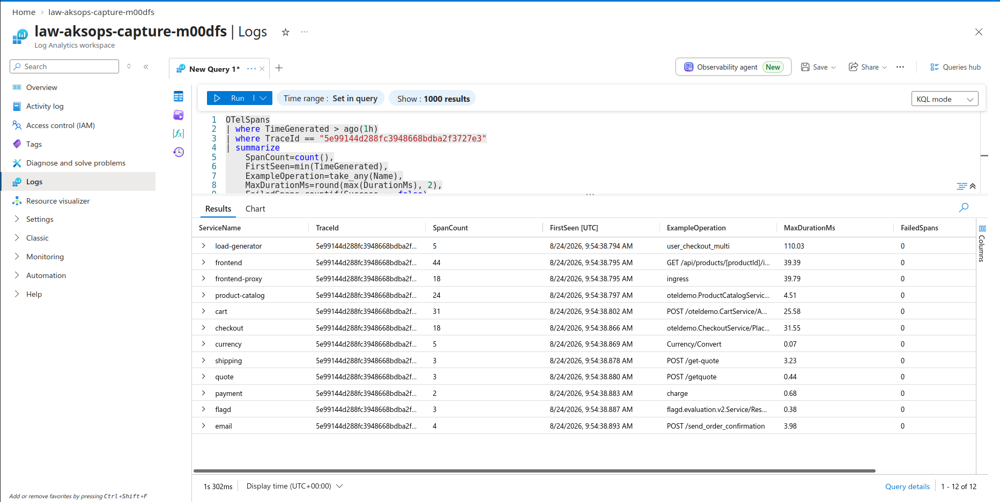</a>

*Temporary capture evidence.* **15. Single checkout trace across 12 services.** One selected trace traverses load generation, the frontend path, cart, checkout, currency, shipping, quote, payment, flagd, and email. This is the operational bridge between a user journey and precise dependency, latency, and failure-path analysis.

~~~kusto
let selectedTrace = toscalar(
    OTelSpans
    | where TimeGenerated > ago(30m)
    | summarize ServiceCount=dcount(ServiceName), SpanCount=count() by TraceId
    | where ServiceCount >= 3
    | order by ServiceCount desc, SpanCount desc
    | take 1
    | project TraceId
);
OTelSpans
| where TraceId == selectedTrace
| project TimeGenerated, ServiceName, Name, DurationMs, Success, TraceId, ParentSpanId
| order by TimeGenerated asc
| take 100
~~~

The query selects a recent multi-service trace dynamically rather than exposing a stale hard-coded identifier.

### Managed Prometheus Application Metrics

The managed Prometheus route is intentionally distinct from the collector's direct OTLP metric stream. The AKS Azure Monitor metrics add-on forwards Prometheus-format metrics through its own DCE/DCR association to the Azure Monitor workspace.

<table>
<tr>
<td width="50%" valign="top">
<a href="docs/screenshots/capture-10a-payment-transactions-graph.png">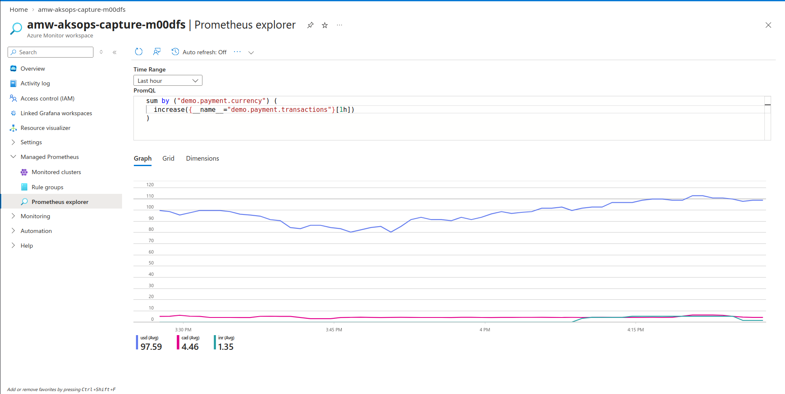</a>
 <strong>16. Payment transactions by currency.</strong> The payment transaction metric has active series during the capture window.
</td>
<td width="50%" valign="top">
<a href="docs/screenshots/capture-10b-managed-prometheus-payment-grid.png">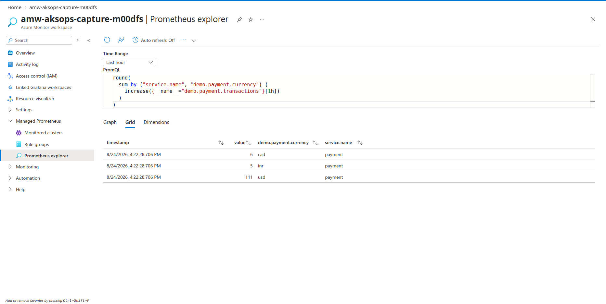</a>
 <strong>17. Payment metric labels and values.</strong> The metric is grouped by payment service and payment currency dimensions.
</td>
</tr>
</table>

~~~promql
sum by ("service.name", "demo.payment.currency") (
  increase({__name__="demo.payment.transactions"}[1h])
)
~~~

The observed result contains <code>service.name=payment</code> and the <code>demo.payment.currency</code> dimension. That confirms application-specific metric ingestion, rather than only node or pod metrics.

### Alerts and Cost Guardrails

Terraform configures three enabled scheduled-query rules against the Log Analytics workspace:

| Alert rule | Severity | Evaluation / window | Intent |
| --- | ---: | --- | --- |
| AKS node not Ready | 2 | 5 minutes / 15 minutes | Detect unavailable cluster nodes |
| Failed or CrashLoopBackOff pod | 2 | 5 minutes / 15 minutes | Surface unhealthy workloads |
| Restart delta greater than 2 | 3 | 5 minutes / 15 minutes | Detect restart churn |

<table>
<tr>
<td width="50%" valign="top">
<a href="docs/screenshots/capture-11a-log-analytics-daily-cap.png">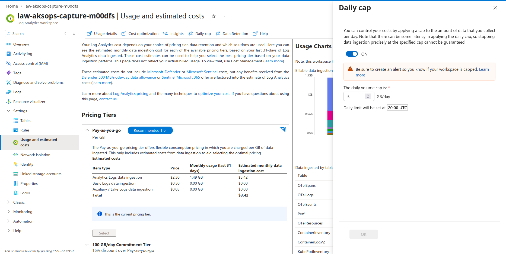</a>
 <strong>18. Capture ingestion cap: 5 GB/day.</strong> 
The temporary Log Analytics cap bounds the evidence run's ingestion exposure while preserving enough signal volume for a meaningful validation window.
</td>
<td width="50%" valign="top">
<a href="docs/screenshots/capture-11b-alert-rules.png">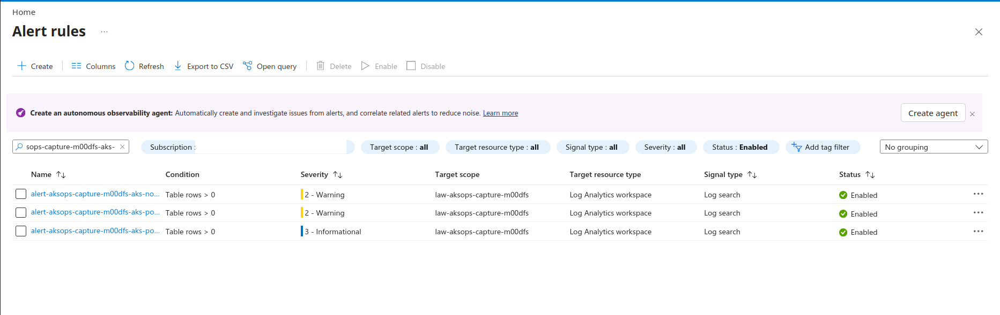</a>
 <strong>19. Three enabled AKS alert rules.</strong> 
The redacted Azure Monitor list confirms coverage for node readiness, failed or CrashLooping pods, and restart churn.
</td>
</tr>
</table>

Cost controls are scoped honestly:

- AKS uses the Free tier and a static two-node pool for this project.
- Managed Grafana is optional in code and disabled by default in both profiles.
- Log Analytics uses the PerGB2018 SKU with 30-day retention.
- The main profile leaves the Log Analytics cap unlimited and defaults Application Insights to 100 GB/day.
- The temporary capture profile uses a 5 GB/day cap for both Log Analytics and Application Insights. It is a short-lived evidence guardrail, **not** a billing guarantee or permanent production policy; usage reporting/enforcement can lag.

### Final acceptance check

<a href="docs/screenshots/capture-12-final-health-check.png">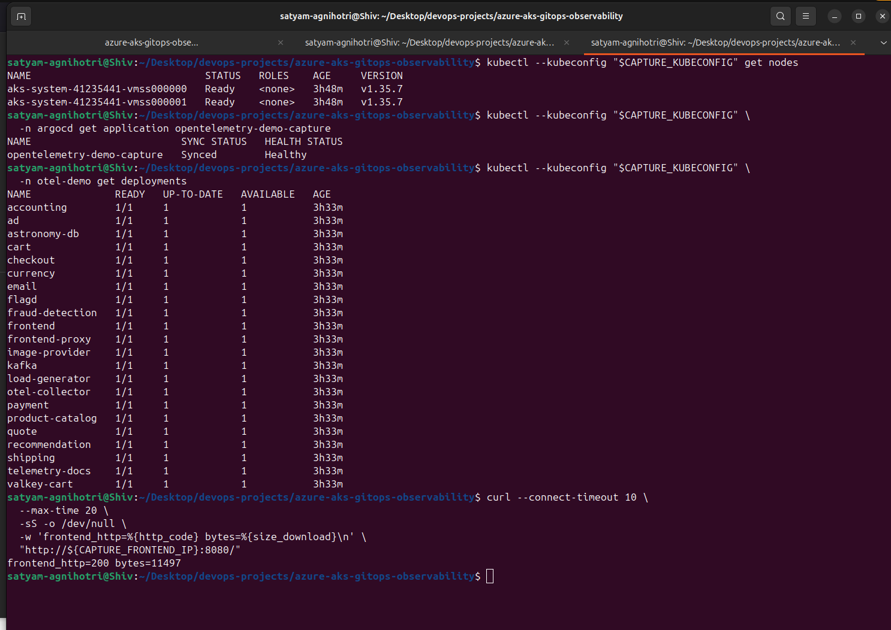</a>

*Temporary capture evidence.* **20. End-to-end acceptance: ready, healthy, HTTP 200.** The closing verification ties the story together: nodes are Ready, Argo CD is Synced and Healthy, the demo deployments are available, and the public frontend responds successfully.

## CI and Delivery Automation

| Workflow | Trigger | Verified responsibility | Explicit boundary |
| --- | --- | --- | --- |
| <code>validate.yml</code> | Relevant pull requests; pushes to <code>main</code> and <code>feature/**</code> | Terraform format, backend-free init and validate; Helm dependency build, lint, and base-chart rendering | No Terraform plan/apply, security scan, Kubernetes server dry-run, or capture-overlay render |
| <code>deploy-aks.yml</code> | Pushes to <code>main</code> affecting <code>app/**</code>, or manual workflow dispatch | OIDC Azure login, builds and pushes the canary with the short Git SHA, changes only the canary image tag in Helm values, bot-commits desired state | No AKS credential retrieval, kubectl, Helm upgrade, or direct Argo CD invocation |

The canary image is currently declared as one replica, ClusterIP, and port 80. Historical validation described an earlier two-replica/LoadBalancer self-heal exercise; that is kept as dated evidence only and is not represented as the current desired state.

### Terraform versus GitOps Ownership

| Terraform owns | Argo CD owns |
| --- | --- |
| Azure resource group, VNet/subnet, AKS, ACR, monitoring resources, DCRs, alerts, Azure role assignments, namespace, collector ServiceAccount, endpoint ConfigMap | Helm-rendered canary and OpenTelemetry Demo workloads, services, deployments, values-driven workload configuration, and reconciliation state |

This split makes cloud lifecycle and Kubernetes application lifecycle independently understandable. It also prevents the delivery workflow from becoming a second Kubernetes deployment controller.

## Security Posture

The controls below are source-backed; they are not a claim of a fully production-hardened environment.

| Control | Implemented evidence |
| --- | --- |
| GitHub delivery authentication | The canary workflow uses GitHub OIDC with Microsoft Entra ID rather than a long-lived Azure cloud credential. The Entra application/federation and <code>AcrPush</code> assignment are external setup. |
| Workload identity | AKS enables OIDC issuer and workload identity. The collector ServiceAccount federates to a user-assigned identity using the exact namespace/service-account subject. |
| Narrow telemetry permission | The collector identity receives <code>Monitoring Metrics Publisher</code> at native OTLP DCR scope. |
| Registry access | ACR admin access is disabled; the AKS kubelet identity receives <code>AcrPull</code> scoped to the project registry. |
| Network permission | The AKS control-plane identity receives <code>Network Contributor</code> scoped to the AKS subnet. |
| Application Insights local auth | Local authentication is disabled; the collector does not receive an instrumentation key or connection string through Git-managed chart values. |
| Terraform state access | The backend template uses Azure CLI/Microsoft Entra authentication and requires Storage Blob Data Contributor instead of a storage-account access key. |
| Repository hygiene | Local backend coordinates, Terraform variables, kubeconfig paths, and alert recipient values are designed to remain ignored rather than committed. |

The direct OTLP DCE has public network access enabled. Its protection shown here is identity-based authentication, not private network isolation. Private AKS/ACR, private endpoints, network policy, Key Vault, policy add-ons, Defender, image signing, SBOMs, and secret rotation are future hardening opportunities rather than implemented claims.

## Reuse and Customization

| Concern | Where to change it | Notes |
| --- | --- | --- |
| Azure region, environment tag, node count, VM size | Root variables and local <code>terraform.tfvars</code> | Main defaults are Central India, dev, two <code>Standard_D2s_v5</code> nodes. |
| Capture-only capacity/network profile | <code>environments/telemetry-capture-eastus.tfvars</code> | Use only in its dedicated workspace and keep its settings separate from main. |
| Dedicated Kubernetes connection | <code>kubeconfig_path</code> input | Terraform Kubernetes-provider objects require a dedicated target-cluster kubeconfig. |
| Alert recipient | <code>alert_email</code> input | Provide locally; do not commit recipient values. |
| Demo composition | <code>helm/opentelemetry-demo/values.yaml</code> | Base profile retains 17 deployment objects. |
| Full temporary demo profile | <code>helm/opentelemetry-demo/values-capture-full.yaml</code> | Restores five extra components for capture only. |
| Public demo exposure | OpenTelemetry Demo values for <code>frontend-proxy</code> | The primary public entry point is port 8080. |
| Canary image/tag | <code>helm/azure-webapp/values.yaml</code> | Delivery workflow updates only the image tag. |
| GitOps source | <code>argocd/*.yaml</code> | The two primary Applications track main; the capture Application tracks its feature branch. |

## Quick Start

### Prerequisites

- Azure CLI authenticated to a subscription where the operator can create the declared resources and role assignments.
- Terraform 1.6.0 or newer.
- kubectl, Helm, Git, and access to an Argo CD installation for the target cluster.
- A remote Terraform backend you own. The backend itself is intentionally external to this configuration.
- Storage Blob Data Contributor for the Terraform operator on the remote-state container when using the supplied AzureRM backend pattern.

### 1. Configure local inputs and backend

~~~bash
git clone <repository-url>
cd azure-aks-gitops-observability

cp terraform.tfvars.example terraform.tfvars
cp backend.hcl.example backend.hcl
~~~

Set a dedicated target-cluster kubeconfig path and alert recipient in the ignored <code>terraform.tfvars</code>. Replace the placeholder backend coordinates in the ignored <code>backend.hcl</code>; the supplied example uses Azure CLI/Microsoft Entra authentication.

~~~bash
terraform init -reconfigure -backend-config=backend.hcl
terraform fmt -check -recursive
terraform validate
~~~

### 2. Bootstrap AKS before Kubernetes-provider resources

Terraform creates a small set of Kubernetes objects, so the dedicated kubeconfig must exist before the complete apply. The safe bootstrap pattern is:

~~~bash
terraform plan -target=module.aks -out=aks-bootstrap.tfplan
terraform apply aks-bootstrap.tfplan

PROJECT_KUBECONFIG=/secure/path/project.kubeconfig
az aks get-credentials \
  --resource-group "$(terraform output -raw resource_group_name)" \
  --name "$(terraform output -raw aks_cluster_name)" \
  --file "$PROJECT_KUBECONFIG"
~~~

Ensure <code>kubeconfig_path</code> in the ignored variables file is the same dedicated file, then complete the platform apply:

~~~bash
terraform plan -out=platform.tfplan
terraform apply platform.tfplan
~~~

### 3. Install Argo CD separately and apply tracked Applications

Argo CD installation/bootstrap is intentionally outside this Terraform configuration. After Argo CD is available in the target cluster, apply the tracked desired-state objects:

~~~bash
kubectl --kubeconfig "$PROJECT_KUBECONFIG" apply \
  -f argocd/opentelemetry-demo-application.yaml

kubectl --kubeconfig "$PROJECT_KUBECONFIG" apply \
  -f argocd/azure-webapp-application.yaml
~~~

### 4. Validate convergence and access the demo

~~~bash
kubectl --kubeconfig "$PROJECT_KUBECONFIG" get nodes

kubectl --kubeconfig "$PROJECT_KUBECONFIG" -n argocd \
  get applications

kubectl --kubeconfig "$PROJECT_KUBECONFIG" -n otel-demo \
  get deployments

kubectl --kubeconfig "$PROJECT_KUBECONFIG" -n otel-demo \
  get service frontend-proxy
~~~

Open the external address reported by <code>frontend-proxy</code> on port 8080. Keep the load generator running long enough for current telemetry data to arrive, then use the KQL and PromQL examples above against the correct workspace.

### 5. Destroy only after review

Treat the temporary capture workspace as a separate destructive target. Never run a destroy plan from the default workspace by accident.

~~~bash
terraform workspace select telemetry-capture-eastus
terraform workspace show
terraform output resource_group_name
terraform output aks_cluster_name

terraform plan -destroy \
  -var-file=environments/telemetry-capture-eastus.tfvars \
  -out=telemetry-capture-destroy.tfplan
terraform show -no-color telemetry-capture-destroy.tfplan
~~~

Confirm the workspace and output names are the temporary East US resources, follow the approved teardown process, and obtain explicit approval before applying the reviewed destroy plan.

## Troubleshooting Playbook

| Symptom | Check | Likely boundary to inspect |
| --- | --- | --- |
| Argo Application is OutOfSync | Inspect the Application source revision, rendered path, and resource tree | Git branch/path/values and Argo reconciliation status |
| Pods are not Ready | Inspect deployments, events, and requests/limits in <code>otel-demo</code> | Capacity, image pulls, and chart values |
| LoadBalancer has no external address | Inspect <code>frontend-proxy</code> service and Azure load-balancer provisioning events | Service type, AKS networking, and Azure quota/network state |
| Native OTel tables are empty | Check collector logs, recent traffic, DCR endpoint configuration, and selected Log Analytics workspace | Collector workload identity, direct OTLP stream URLs, DCR, and time range |
| PromQL query is empty | Verify the Azure Monitor workspace and widen the time range | Metrics add-on/DCR association, query scope, and dot-containing metric syntax |
| Container data is delayed | Check the Container Insights DCR association and allow for ingestion delay | Azure Monitor agent, DCR streams, and workspace selection |
| Terraform cannot manage Kubernetes handoff objects | Confirm <code>kubeconfig_path</code> points to the intended dedicated cluster file | Bootstrap order and target-cluster context |

Use the portal workflow outlined above to collect capture images without exposing sensitive information.

## Design Decisions and Trade-offs

### Key Decisions

- **Azure-native observability backends:** The project deliberately avoids operating self-hosted Jaeger, Prometheus, Grafana, and OpenSearch in the cluster. This keeps the implementation focused on Azure Monitor, Log Analytics, Managed Prometheus, DCRs, and native OTLP ingestion.
- **GitOps instead of CI-driven kubectl:** CI promotes the canary image through Git. Argo CD reconciles Kubernetes desired state. This keeps a reviewable desired-state history and avoids hidden imperative deployment steps in CI.
- **OpenTelemetry Demo as a workload, not product code:** A real multi-service demo creates useful distributed telemetry while keeping the platform work distinct from application authorship.
- **Terraform ownership limited to platform handoffs:** Namespace, collector ServiceAccount, and endpoint ConfigMap stay with the platform because they are identity/configuration prerequisites. Helm workload objects stay with Argo CD.
- **Temporary capture environment:** The isolated East US profile allowed a full-telemetry evidence window without redefining the lower-capacity main-release architecture.

### Scope and Limitations

- This is a demonstrable engineering platform, not a high-availability production topology.
- Both profiles use a static two-node pool; no autoscaling, zone distribution, PDBs, or backup/DR configuration is declared.
- The demo public endpoint uses a LoadBalancer for accessibility; no ingress, custom domain, TLS termination, or WAF is configured here.
- The native OTLP DCE is publicly accessible at the network layer; the implemented protection is workload identity, not private networking.
- The alert set is intentionally focused on node readiness, failed/CrashLooping pods, and restart churn. It is not an SLO/SLI program.
- Managed Grafana is disabled to limit optional service cost. Prometheus evidence is collected through Azure Monitor workspace query surfaces instead.

### Production-Hardening Opportunities

These are future options, not present-tense claims:

- Private AKS API, private ACR, Private Link/private endpoints, and egress control.
- Network policies, Azure Policy, Defender, workload admission controls, and hardened pod security settings.
- Key Vault CSI integration and a defined secret-rotation strategy.
- Availability-zone-aware node pools, autoscaling, PodDisruptionBudgets, backup/restore, and disaster-recovery design.
- Ingress with TLS and WAF, custom domains, and controlled public exposure.
- SLOs, broader alert coverage, dashboarding/Managed Grafana evaluation, and retention/cost policies by environment.
- Multi-environment promotion, progressive delivery, image provenance/signing, SBOMs, and supply-chain scanning.

## Live Evidence Index

All 20 temporary-capture images are embedded in the narrative above and indexed here in reading order. Together they show the full path from Azure foundation through a public order and into operational telemetry, guardrails, and final acceptance.

| Step | Evidence | What it proves |
| ---: | --- | --- |
| 1 | [Azure foundation](docs/screenshots/capture-02-resource-group.png) | The temporary resource group contains the platform building blocks. |
| 2 | [AKS control plane](docs/screenshots/capture-03-aks-overview.png) | The capture cluster is running with the intended network profile and registry connection. |
| 3 | [System node pool](docs/screenshots/capture-03b-node-pool.png) | Two nodes are ready to run the capture workload. |
| 4 | [Argo CD summary](docs/screenshots/capture-04-argocd-application.png) | The capture Application is Synced and Healthy. |
| 5 | [Argo CD resource tree](docs/screenshots/capture-04b-argocd-application.png) | Desired state resolves to healthy workload resources and pods. |
| 6 | [Runtime readiness](docs/screenshots/capture-01-terminal-readiness.png) | Nodes, deployments, and GitOps state pass an independent terminal gate. |
| 7 | [Public entry point](docs/screenshots/capture-05a-public-loadbalancer.png) | The frontend is exposed through the capture LoadBalancer. |
| 8 | [Storefront](docs/screenshots/capture-05b-storefront-home.png) | The browser reaches the demo experience. |
| 9 | [Product interaction](docs/screenshots/capture-05c-product-page.png) | A product request exercises the application path. |
| 10 | [Sample checkout](docs/screenshots/capture-05d-cart-checkout.png) | Cart and checkout state are available before submission. |
| 11 | [Order completion](docs/screenshots/capture-05e-order-complete.png) | A completed demo order produces realistic traffic. |
| 12 | [Container Insights](docs/screenshots/capture-06-container-insights.png) | Kubernetes health is visible across the cluster. |
| 13 | [Native OTel records](docs/screenshots/capture-07-native-otel-records.png) | Traces, events, logs, and resources are arriving in native tables. |
| 14 | [Service performance](docs/screenshots/capture-08-service-performance.png) | Per-service spans, traces, latency, and error data are queryable. |
| 15 | [Distributed trace](docs/screenshots/capture-09-distributed-trace.png) | One checkout request is correlated across multiple services. |
| 16 | [Payment metric graph](docs/screenshots/capture-10a-payment-transactions-graph.png) | Managed Prometheus records payment transactions by currency. |
| 17 | [Payment metric values](docs/screenshots/capture-10b-managed-prometheus-payment-grid.png) | The metric exposes its service and currency dimensions. |
| 18 | [Ingestion cap](docs/screenshots/capture-11a-log-analytics-daily-cap.png) | The temporary evidence run has a 5 GB/day cost guardrail. |
| 19 | [Alert rules](docs/screenshots/capture-11b-alert-rules.png) | Node, pod, and restart alerts are enabled. |
| 20 | [Final health check](docs/screenshots/capture-12-final-health-check.png) | The platform finishes Ready, Synced, Healthy, and responsive. |

The retired numbered screenshots are not included because they describe an earlier architecture rather than this temporary capture profile.

## Key Takeaways

- The repository documents a real control-plane split: Terraform for Azure platform resources, GitHub Actions for canary image promotion, and Argo CD for workload reconciliation.
- The demo proves operational observability with Azure-native data paths, not a generic “monitoring installed” claim.
- The root README presents the temporary capture in a clear sequence so each visual proof is interpreted in the context of the platform stage it validates.
- The project’s most useful next conversation is not “does it deploy?” but how to evolve its consciously non-production choices into a hardened multi-environment platform.
