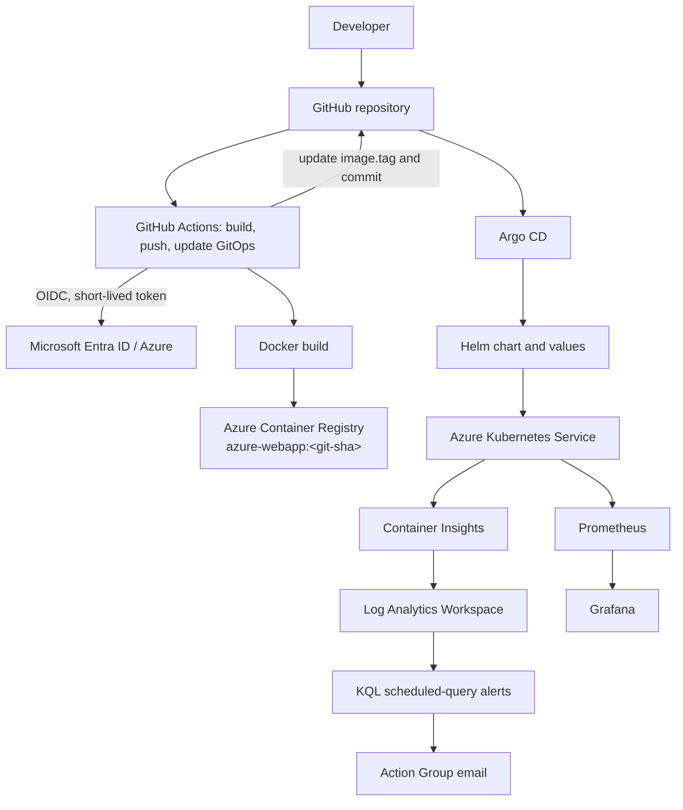

# Implementation Plan

Date: 2026-08-23
Principle: implementation is phase-based; only observed validation is marked as passed.

## Target Architecture

## Phase 0 — Repository Audit

**Objective:** establish verified starting state before implementation.
**Current state:** complete; findings are in `00-REPO-AUDIT.md`.
**Required changes:** documentation only.
**Files affected:** `docs/codex/00-REPO-AUDIT.md`, status, validation, decisions, handoff.
**Commands/actions:** inspect Git, all Terraform/modules, workflow, chart, Argo manifest, application, docs, and configured references.
**Expected result:** an implementation plan based on code rather than README claims.
**Validation:** audit records hardcoded backend, Argo overrides, direct CI AKS access, legacy manifests, and stale documentation.
**Rollback/recovery:** documentation is additive.
**Dependencies:** none.
**Human action required?:** no.

## Phase 1 — Planning and Tracking

**Objective:** create durable project-state, validation, decision, and handoff records.
**Current state:** in progress at plan creation; no cloud state is assumed.
**Required changes:** maintain the six `docs/codex/` documents continuously.
**Files affected:** `docs/codex/*.md`.
**Commands/actions:** record each meaningful implementation and command result.
**Expected result:** a future session can safely resume.
**Validation:** handoff identifies exact current blocker/action.
**Rollback/recovery:** revert documentation only if factually wrong.
**Dependencies:** Phase 0.
**Human action required?:** no.

## Phase 2 — Project Identity and Deployment Source

**Objective:** finalize the DevOps project identity and one active deployment model.
**Current state:** chart/deployment already use `azure-webapp`; static page and docs are stale; raw `k8s/` is unused.
**Required changes:** update page wording, remove stale raw manifests after chart validation, and remove their references from docs.
**Files affected:** `app/index.html`, `k8s/` (deletion), README and phase docs.
**Commands/actions:** render/lint Helm first; search for obsolete manifest references after removal.
**Expected result:** Helm + Argo CD is the only active application-deployment model.
**Validation:** `helm lint`, `helm template`, and no `k8s/` deployment references.
**Rollback/recovery:** restore deleted legacy files from Git if needed; Helm remains source of truth.
**Dependencies:** Helm validation tooling.
**Human action required?:** no.

## Phase 3 — Terraform State, Inputs, and Quality

**Objective:** remove upstream state coupling and establish reproducible local configuration.
**Current state:** hardcoded backend, ignored lock file, missing examples; provider not initialized.
**Required changes:** empty `backend "azurerm" {}`, a Microsoft Entra ID/Azure CLI `backend.hcl.example`, `.gitignore` protection for `backend.hcl`, lock-file tracking, and `terraform.tfvars.example`. Verify managed-identity monitoring support from the installed provider schema before any change to `modules/aks/main.tf`.
**Files affected:** `.gitignore`, `providers.tf`, `backend.hcl.example`, `terraform.tfvars.example`, optionally `modules/aks/main.tf`.
**Commands/actions:** `terraform fmt -recursive`; `terraform init -backend=false`; inspect provider schema; `terraform validate`; later init with local `backend.hcl`.
**Expected result:** code contains no personal backend coordinates and can validate without remote-state access.
**Validation:** fmt check, validate, tracked lock file; provider-schema evidence for monitoring choice.
**Rollback/recovery:** retain ignored `backend.hcl`; use `terraform init -reconfigure -backend-config=backend.hcl` after bootstrap.
**Dependencies:** Terraform and provider download.
**Human action required?:** no for local validation; yes before backend bootstrap if Azure login is unavailable.

## Phase 4 — Azure Backend Bootstrap and Infrastructure

**Objective:** create an owner-controlled remote state backend and provision the planned Azure resources.
**Current state:** Azure CLI is absent and subscription state is unverified.
**Required changes:** create local ignored `backend.hcl` and ignored `terraform.tfvars` only after confirming active subscription and values.
**Files affected:** local ignored files only; status/validation docs.
**Commands/actions:** install/use Azure CLI, `az account show`, inspect active subscription, create a state RG/storage/container through Azure CLI, initialize backend, run plan, summarize additions/changes/destroys and major cost drivers, then apply.
**Expected result:** resource group, VNet/subnet, ACR, Log Analytics, AKS, ACR pull role, Action Group, and three alert rules exist.
**Validation:** Terraform apply/output collection, `az acr show`, AKS nodes Ready, `kubectl get pods -A`; no ACR admin enablement.
**Rollback/recovery:** do not run destroy without explicit user approval; preserve remote state backend until all evidence is captured.
**Dependencies:** Azure CLI, authenticated user, known active subscription, permitted quota, chosen alert email.
**Human action required?:** yes — Azure login/subscription confirmation and an alert-email value.

## Phase 5 — GitHub OIDC and Least-Privilege CI

**Objective:** establish passwordless GitHub-to-Azure ACR publishing.
**Current state:** OIDC action code exists; federated identity, RBAC, GitHub configuration, and runs are unverified.
**Required changes:** prepare and run owner-scoped Entra app/service-principal/federated-credential setup; grant only `AcrPush` at this ACR; set required GitHub secrets and repository variables.
**Files affected:** documentation/status; GitHub settings outside repository.
**Commands/actions:** derive `devSatym/azure-aks-gitops-observability` from `origin`; create a main-branch federated subject (`repo:devSatym/azure-aks-gitops-observability:ref:refs/heads/main`) after current official syntax is verified; configure `AZURE_CLIENT_ID`, `AZURE_TENANT_ID`, `AZURE_SUBSCRIPTION_ID`, `ACR_NAME`, `ACR_LOGIN_SERVER`, and `IMAGE_NAME=azure-webapp`.
**Expected result:** CI can log in through OIDC and push to ACR without client secrets or AKS-admin access.
**Validation:** a real workflow run and ACR tag listing.
**Rollback/recovery:** remove only created role assignment/federated credential if configuration is wrong; do not broaden permissions.
**Dependencies:** deployed ACR, Azure/Entra permission, GitHub repository admin access.
**Human action required?:** yes — GitHub/Azure authorization where interactive access is required.

## Phase 6 — Helm, Argo CD, and CI-to-GitOps Handoff

**Objective:** make Git Helm values the single desired-state source and make Argo CD deployment owner.
**Current state:** values use an empty/latest image, Argo overrides values with stale upstream coordinates, and CI only pushes an image.
**Required changes:** set a documented bootstrap image repository/tag policy, remove Argo image parameters, point Argo to origin repository, set CI `contents: write`, update only `image.tag`, commit using `github-actions[bot]` with `[skip ci]`, add concurrency, and remove AKS variables/credentials step.
**Files affected:** Helm values, Argo Application, workflow, README/phase docs/decisions.
**Commands/actions:** YAML and Helm render validation; inspect the exact values-file diff logic; search for direct CI deploy commands.
**Expected result:** CI owns build/push/Git update; Argo owns sync/reconciliation; SHA tags are immutable.
**Validation:** local workflow structure review; after deployment, one source-change run yields an ACR image, one GitOps commit, a synced/healthy Argo app, a rollout, and reachable page.
**Rollback/recovery:** change `image.tag` back to a known-good SHA and commit; let Argo reconcile.
**Dependencies:** deployed ACR, configured CI identity, GitHub write permission, AKS.
**Human action required?:** yes for external GitHub/Azure configuration and real execution.

## Phase 7 — Argo CD Install and GitOps Validation

**Objective:** install Argo CD by Helm and prove synchronization/self-healing.
**Current state:** only Application manifest is stored.
**Required changes:** none to Terraform; install Argo in namespace `argocd`, then apply the manifest.
**Files affected:** status, validation, handoff, README/operations docs.
**Commands/actions:** official current Helm installation steps; `kubectl get pods -n argocd`; apply Application; inspect application status; scale deployment away from desired replicas and observe restore.
**Expected result:** core pods healthy, Application Synced/Healthy, desired replicas restored automatically.
**Validation:** Argo status plus timestamped drift test.
**Rollback/recovery:** delete Application or Helm uninstall Argo only as documented cleanup, never automatically.
**Dependencies:** reachable AKS cluster, GitHub repo accessibility.
**Human action required?:** no after Azure access is usable.

## Phase 8 — Azure Monitoring, Alerting, Prometheus, and Grafana

**Objective:** validate both Azure-native logs/alerts and Kubernetes metrics.
**Current state:** Terraform declares monitoring/alerts but nothing is locally proven; monitoring stack is not installed.
**Required changes:** install `kube-prometheus-stack` with Helm into `monitoring`; no Terraform expansion.
**Files affected:** operational docs, validation, screenshot checklist, status.
**Commands/actions:** wait for Container Insights ingestion; run schema-appropriate KQL over the actual configured tables; inspect the three alert rules/action group; create a safe disposable crash-loop only if it satisfies an actual query; delete test afterward; install/verify stack; port-forward Grafana and generate application traffic.
**Expected result:** data reaches Log Analytics, queries return current cluster/workload data, at least one real alert fires and notifies, and Grafana Kubernetes dashboards populate.
**Validation:** timestamped query/alert/notification and healthy Prometheus/Grafana pods.
**Rollback/recovery:** delete disposable crash-test pod; Helm uninstall monitoring only as documented cleanup.
**Dependencies:** deployed AKS/Log Analytics/alerts, alert email confirmation, Azure portal/API access.
**Human action required?:** yes — confirm Action Group email and capture/confirm notification.

## Phase 9 — Evidence, Final Documentation, Resume, and Cleanup Plan

**Objective:** publish only evidence-backed project documentation and a practical handoff.
**Current state:** inherited screenshots and README claims cannot serve as validation.
**Required changes:** create screenshot checklist, rewrite README after tests, fill validation matrix, write resume and interview materials, document cleanup without executing destruction.
**Files affected:** `docs/screenshots/README.md`, README, `docs/RESUME.md`, `docs/INTERVIEW-PREP.md`, `docs/codex/*`, relevant phase docs.
**Commands/actions:** final Terraform/Kubernetes/CI/GitOps/monitoring validation suite; secret scan before commits; prepare explicit cleanup commands.
**Expected result:** claims match evidence, user can present/resume the project, and a later destroy is safe to review.
**Validation:** validation matrix has observed facts, not assumptions; no secrets tracked.
**Rollback/recovery:** documentation can be corrected; `terraform destroy` requires explicit user approval only after evidence capture.
**Dependencies:** all applicable earlier validation.
**Human action required?:** yes for screenshots and any optional cleanup authorization.
