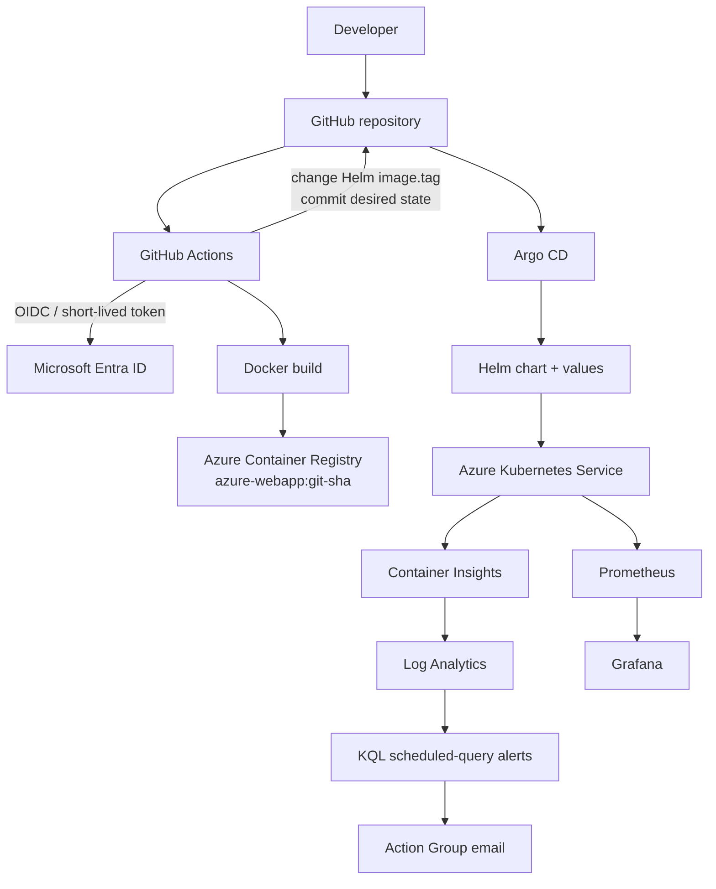

# Implementation Plan

Date: 2026-08-24
Rule: only observed results are marked as validated. No client secret, ACR admin credential, direct CI-to-AKS deployment, or destructive cleanup will be substituted for the intended design.

## Target Architecture

## Current Gate

Azure and GitHub are authenticated and the subscription was inspected without switching it. The dedicated AzureRM backend and all 13 planned project resources exist. Argo CD 3.5.1 is healthy, and the first CI → ACR → Git → Argo delivery is proven: OIDC login succeeded, the immutable source SHA image was pushed, the bot changed only Helm `image.tag`, Argo synchronized it, and the LoadBalancer served the updated page. Argo self-heal restored a temporary replica drift from four to two. Prometheus/Grafana are healthy. Azure-native telemetry exposed one source gap: the AKS add-on runs in managed-identity mode, but no Container Insights DCR/DCRA was created. A reviewed saved plan adds exactly that Terraform-managed DCR and association before telemetry validation resumes.

## Phase 0 — Complete Repository Audit

- **Objective:** establish code and environment facts before further implementation.
- **Current state:** complete and reconciled in `00-REPO-AUDIT.md`.
- **Required changes:** documentation only.
- **Files affected:** `docs/codex/00-REPO-AUDIT.md`, status, validation, decisions, handoff.
- **Commands/actions:** inspect all tracked implementation/docs, remote/status, ownership markers, local CLIs, Azure inventory, and GitHub configuration names.
- **Expected result:** a plan based on current code rather than inherited claims.
- **Validation:** audit records the local-only commits, no active upstream coupling, and external prerequisites.
- **Rollback/recovery:** documentation is additive/correctable.
- **Dependencies:** none.
- **Human action required?:** no.

## Phase 1 — Implementation Plan and Live Tracking

- **Objective:** make progress resumable and evidence-led.
- **Current state:** this plan and the six `docs/codex/` trackers exist; ongoing.
- **Required changes:** update status, evidence, decisions, and handoff after meaningful work.
- **Files affected:** `docs/codex/*.md`.
- **Commands/actions:** record commands/results without tokens, passwords, state, storage keys, or email addresses.
- **Expected result:** a new session can resume safely.
- **Validation:** status names the exact phase, blocker, next command, and observed results.
- **Rollback/recovery:** correct inaccurate prose; never manufacture evidence.
- **Dependencies:** Phase 0.
- **Human action required?:** no.

## Phase 2 — Clean Project Identity

- **Objective:** retain one DevOps identity and the `azure-webapp` workload name.
- **Current state:** complete locally: page, chart, Application, image name, Deployment, and Service use `azure-webapp`.
- **Required changes:** remove remaining inherited branding only when final docs are rewritten; retain required upstream credit.
- **Files affected:** final `README.md`, `docs/phases/*`, `docs/RESUME.md`, `docs/INTERVIEW-PREP.md`.
- **Commands/actions:** repeat repository-wide stale-value search after documentation changes.
- **Expected result:** no description as a platform/internal developer platform and no competing identity.
- **Validation:** active source has no upstream naming markers.
- **Rollback/recovery:** restore only a necessary attribution reference.
- **Dependencies:** Phase 0.
- **Human action required?:** no.

## Phase 3 — Terraform State, Inputs, and Quality Corrections

- **Objective:** keep state owner-controlled and correct deployment-blocking Terraform issues before Azure apply.
- **Current state:** empty AzureRM backend, ignored local configuration, input examples, tracked lock, and monitoring MSI setting are already present; local fmt/init/validate pass.
- **Required changes:** add subnet-scoped `Network Contributor` for the AKS control-plane identity; make managed-identity role assignments resilient to directory replication; correct CrashLoop and restart-delta KQL rules.
- **Files affected:** `main.tf`, `modules/aks/outputs.tf`, `modules/alerts/main.tf`, `docs/codex/04-DECISIONS.md`, validation/status.
- **Commands/actions:** patch the minimum Terraform, then run `terraform fmt -recursive`, `terraform init -backend=false`, and `terraform validate`.
- **Expected result:** Azure CNI AKS has its required custom-subnet permission and an intentional failed pod can match an alert rule without a permanently cumulative restart condition.
- **Validation:** Terraform validation; later real role/query checks after apply.
- **Rollback/recovery:** revert only the newly added role assignment/query changes; do not change to a client secret or ACR admin credential.
- **Dependencies:** Phase 0; current AzureRM/Azure Monitor documentation.
- **Human action required?:** no.

## Phase 4 — Azure Backend Bootstrap

- **Objective:** create an owner-controlled remote Terraform state backend.
- **Current state:** complete. Azure CLI remains on its inspected active subscription; `rg-aksops-dev-tfstate` / `staksopsdevtf20260824` / `tfstate` are initialized without a subscription switch.
- **Required changes:** preserve the remote state backend; no source change is needed.
- **Files affected:** ignored `backend.hcl`; tracking docs only.
- **Commands/actions:** inspect active subscription, register required providers, create backend resources via Azure CLI, then `terraform init -reconfigure -backend-config=backend.hcl`.
- **Expected result:** achieved — remote state uses Entra/Azure CLI authentication, not a storage key.
- **Validation:** `terraform init -reconfigure -backend-config=backend.hcl` and data-plane blob listing succeeded; `backend.hcl` is ignored.
- **Rollback/recovery:** retain the backend until all project evidence is captured; delete only under an approved cleanup plan.
- **Dependencies:** active Azure subscription and permission to create storage/RBAC.
- **Human action required?:** no.

## Phase 5 — Terraform Plan and Apply

- **Objective:** provision one intended Azure environment with no unexpected destruction.
- **Current state:** complete. The ignored local inputs used Central India, `aksops`, `dev`, two `Standard_D2s_v5` nodes, and the supplied recipient. The saved plan applied as 13 creates, 0 changes, and 0 destroys.
- **Required changes:** none before later operational validation.
- **Files affected:** ignored `terraform.tfvars`, ignored `tfplan`, status/validation docs.
- **Commands/actions:** `fmt -check`, `validate`, `plan -out=tfplan`; document adds/changes/destroys and major cost drivers; apply only the reviewed plan.
- **Expected result:** resource group, VNet/subnet, ACR, AKS, Log Analytics, ACR pull/network roles, Action Group, and three alerts exist.
- **Validation:** outputs were collected; ACR reports Basic SKU/admin disabled; both AKS nodes and system/Container Insights pods are Ready through the dedicated kubeconfig.
- **Rollback/recovery:** do not run destroy; resolve quota/provider errors with the smallest documented change.
- **Dependencies:** Phase 4, quota, selected deployment inputs, alert recipient.
- **Human action required?:** no; recipient input is received and remains untracked.

## Phase 6 — GitHub to Azure OIDC

- **Objective:** grant CI passwordless, ACR-only publishing access.
- **Current state:** configured. A dedicated Entra application/service principal has one main-branch federation and `AcrPush` at this ACR only. GitHub has the three required `AZURE_*` secrets and three non-secret ACR/image variables; no client secret exists.
- **Required changes:** prove the configuration with a real workflow run. If `az acr login` shows a same-scope ARM-read authorization error, add only the smallest documented read role at the ACR scope; do not grant subscription or AKS access.
- **Files affected:** GitHub/Azure configuration and tracking docs; no client secret file.
- **Commands/actions:** derive the subject dynamically from `gh api repos/devSatym/azure-aks-gitops-observability/actions/oidc/customization/sub --jq .sub_claim_prefix` and append `:ref:refs/heads/main`; the repository currently emits GitHub's immutable subject prefix, so the old name-only subject must not be used.
- **Expected result:** CI can log in with a short-lived token and push only to the project ACR.
- **Validation:** a real workflow OIDC login and ACR SHA-tag listing.
- **Rollback/recovery:** remove only the created federation/RBAC if misconfigured; never broaden to subscription Contributor.
- **Dependencies:** deployed ACR, Entra/RBAC permission, GitHub repository admin access.
- **Human action required?:** no; tenant configuration succeeded.

## Phase 7 — Helm as Desired-State Source

- **Objective:** retain Git/Helm values as the only image source.
- **Current state:** complete: `values.yaml` is the only image source and its repository is the Terraform-created `acr_login_server/azure-webapp`; `bootstrap` remains a safe non-deployable placeholder until CI promotes a SHA.
- **Required changes:** CI continues to change only `image.tag`.
- **Files affected:** `helm/azure-webapp/values.yaml`, status/validation docs.
- **Commands/actions:** edit the repository value after collecting outputs; run `helm lint` and `helm template`.
- **Expected result:** no `latest` deployment tag and no conflicting image setting.
- **Validation:** render uses the real ACR and an immutable tag.
- **Rollback/recovery:** return `image.tag` to a known-good SHA through Git.
- **Dependencies:** Phase 5 outputs.
- **Human action required?:** no.

## Phase 8 — Argo CD Application Configuration

- **Objective:** keep Argo correctly pointed at the fork/chart with automated sync.
- **Current state:** complete locally; repo URL, path, revision, prune, and self-heal are correct; image overrides are removed.
- **Required changes:** none unless the remote URL/default branch changes.
- **Files affected:** `argocd/azure-webapp-application.yaml`, final docs.
- **Commands/actions:** YAML/render review before applying the Application.
- **Expected result:** Argo reads the Helm values from the fork.
- **Validation:** later Application is `Synced` and `Healthy`.
- **Rollback/recovery:** use a Git revert or delete the Application only during documented cleanup.
- **Dependencies:** Phase 7 and an accessible AKS cluster.
- **Human action required?:** no.

## Phase 9 — GitHub Actions CI to GitOps Promotion

- **Objective:** publish an immutable image then commit the desired tag rather than deploy directly.
- **Current state:** source is pushed to `origin/main`; the required GitHub configuration is present and the real ACR repository is committed to Helm values.
- **Required changes:** trigger and inspect the first app-source workflow run.
- **Files affected:** `.github/workflows/deploy-aks.yml`, Helm values during a real promotion, GitHub configuration.
- **Commands/actions:** trigger an app change, inspect the exact GitOps diff and commit.
- **Expected result:** checkout → OIDC → ACR build/push → exact `image.tag` update → bot commit/push; no AKS control step.
- **Validation:** workflow run, ACR tag, one promotion commit, and later Argo rollout correlate to the source SHA.
- **Rollback/recovery:** commit a known-good tag and let Argo reconcile.
- **Dependencies:** Phases 5–7 and GitHub write permission.
- **Human action required?:** no after external OIDC setup.

## Phase 10 — Remove CI Direct AKS Control

- **Objective:** ensure CI never owns routine Kubernetes deployment.
- **Current state:** complete locally; no AKS variables, credentials, `kubectl`, Helm upgrade, or Argo sync command remain in the workflow.
- **Required changes:** none.
- **Files affected:** final documentation/decisions only.
- **Commands/actions:** source search and workflow review.
- **Expected result:** clear CI/Argo ownership boundary.
- **Validation:** source scan and real workflow behavior.
- **Rollback/recovery:** not applicable; do not reintroduce direct CI deployment.
- **Dependencies:** Phase 9.
- **Human action required?:** no.

## Phase 11 — Retire Raw Manifests

- **Objective:** keep one active application deployment model.
- **Current state:** complete locally; `k8s/` was removed after Helm renders one equivalent Deployment and Service.
- **Required changes:** remove stale raw-manifest instructions during final docs work.
- **Files affected:** inherited README/phase documents.
- **Commands/actions:** repository-wide reference search.
- **Expected result:** Helm + Argo CD is the only documented active model.
- **Validation:** no active raw-manifest paths/commands remain.
- **Rollback/recovery:** recover historical files from Git only if necessary; do not activate them.
- **Dependencies:** Phase 7.
- **Human action required?:** no.

## Phase 12 — Install Argo CD

- **Objective:** install Argo CD using Helm in namespace `argocd`.
- **Current state:** complete. Helm chart `argo-cd` 10.4.0 / Argo CD 3.5.1 is deployed in `argocd`; its core pods and Application CRD are healthy.
- **Required changes:** none before routine operational validation; do not Terraform-manage Argo.
- **Files affected:** cluster state and tracking docs.
- **Commands/actions:** follow current official Argo Helm instructions and wait for core pods. Do not apply the Application until Phase 13 produces a real ACR SHA tag in Git; the bootstrap image does not exist.
- **Expected result:** Argo core components are healthy and ready to reconcile the Application.
- **Validation:** release status is `deployed`; application-controller, repo-server, server, Redis, Dex, notification, and ApplicationSet components are Running.
- **Rollback/recovery:** Helm uninstall only in the approved cleanup sequence.
- **Dependencies:** Phases 5, 7, 8, and a pushed public fork.
- **Human action required?:** no.

## Phase 13 — First End-to-End Delivery Test

- **Objective:** prove one harmless app change reaches AKS through CI → Git → Argo.
- **Current state:** complete. Source commit `9d37a77` added a visible delivery marker; its successful GitHub Actions run built/pushed `azure-webapp:9d37a77` and bot commit `751d2c4` changed only Helm `image.tag`.
- **Required changes:** retain the proven promotion sequence for future application changes.
- **Files affected:** `app/index.html`, Helm `image.tag`, evidence/status docs.
- **Commands/actions:** push an app change to create the first image/promotion commit; verify the SHA tag exists; only then apply `argocd/azure-webapp-application.yaml`. Collect source SHA, image tag/digest, GitOps SHA, Argo revision, ReplicaSet/deployment revision, and response.
- **Expected result:** an immutable image is built/pushed, desired state commits, then Argo deploys a known-existing image and new pods serve the change.
- **Validation:** OIDC job succeeded; ACR tag/digest exists; Argo is `Synced`/`Healthy` at `751d2c4`; Deployment revision 1 has two Ready pods; the LoadBalancer served the marker.
- **Rollback/recovery:** use Git to promote a known-good tag.
- **Dependencies:** Phases 6, 9, 12.
- **Human action required?:** no.

## Phase 14 — GitOps Drift Test

- **Objective:** prove Argo self-heal restores desired replicas.
- **Current state:** complete. The Deployment was scaled from two to four replicas at `2026-08-24T08:29:32+05:30`; Argo reported `OutOfSync`/`Progressing` and restored two Ready replicas by `2026-08-24T08:30:00+05:30` without a Git change.
- **Required changes:** no Git configuration change; temporary live scale only.
- **Files affected:** cluster state during test and validation docs.
- **Commands/actions:** record desired count, `kubectl scale deployment azure-webapp --replicas=4`, observe restoration without editing Git.
- **Expected result:** Application becomes out of sync briefly and returns to desired replicas.
- **Validation:** timestamped deployment and Application status show the temporary drift and restoration in 28 seconds.
- **Rollback/recovery:** Argo self-heal; manually restore only if reconciliation demonstrably fails.
- **Dependencies:** Phase 12.
- **Human action required?:** no.

## Phase 15 — Azure Container Insights

- **Objective:** confirm AKS telemetry reaches its Log Analytics workspace.
- **Current state:** AKS is provisioned and `ama-logs` DaemonSet/ReplicaSet pods are Running. Initial direct queries returned zero records; Azure resource inspection confirmed no Container Insights DCR or DCR association exists, and agent logs report missing DCR JSON.
- **Required changes:** apply the reviewed two-resource Terraform correction: a standard Container Insights DCR with the required pod/node/container streams and its association to this AKS cluster. Then wait for fresh ingestion and rerun the exact timestamped queries.
- **Files affected:** validation/status docs.
- **Commands/actions:** inspect AKS monitoring profile, wait for ingestion, inspect node/controller/container/pod data.
- **Expected result:** current cluster inventory is available in Log Analytics.
- **Validation:** timestamped query results using the deployed workspace.
- **Rollback/recovery:** diagnose the existing monitoring configuration; do not replace it with another stack.
- **Dependencies:** Phase 5, the DCR/DCRA correction, and ingestion delay.
- **Human action required?:** no.

## Phase 16 — Log Analytics / KQL

- **Objective:** run schema-appropriate queries over the actual telemetry.
- **Current state:** configuration and query syntax are inspected; actual result sets remain empty during initial ingestion.
- **Required changes:** rerun pod/node queries after ingestion, then verify current columns/results before marking this phase complete.
- **Files affected:** validation/docs only.
- **Commands/actions:** query recent pods/nodes and review actual schema before calling any test successful.
- **Expected result:** meaningful workload/cluster queries return records.
- **Validation:** saved query text and redacted result evidence.
- **Rollback/recovery:** adjust only query documentation if the deployed schema differs.
- **Dependencies:** Phase 15.
- **Human action required?:** no.

## Phase 17 — Azure Monitor Alert Rules

- **Objective:** verify the three Terraform-created rules and their Action Group.
- **Current state:** configuration complete. One enabled Action Group with one receiver and three enabled scheduled-query rules exist; each has a 5-minute frequency and 15-minute window, with the inspected KQL/threshold/action-group association from Terraform.
- **Required changes:** no Terraform change; verify runtime evaluation after telemetry arrives.
- **Files affected:** `modules/alerts/main.tf`, tracking/docs.
- **Commands/actions:** inspect alert names, queries, frequencies, windows, thresholds, action group, and enabled state.
- **Expected result:** Node Not Ready, failed/CrashLoop, and recent-restart alerts are live.
- **Validation:** Azure CLI/API/portal rule inspection.
- **Rollback/recovery:** correct Terraform query/configuration, not portal drift.
- **Dependencies:** Phases 3, 5, 15.
- **Human action required?:** no.

## Phase 18 — Controlled Alert Test

- **Objective:** cause one safe, reversible alert that matches a real rule.
- **Current state:** not started.
- **Required changes:** temporary disposable failed pod only after KQL results are visible.
- **Files affected:** transient cluster object and validation docs.
- **Commands/actions:** create a `restartPolicy: Never` busybox failure (or an equivalent minimal resource proven to satisfy the deployed query), record timestamps through ingestion/alert/email, then delete it.
- **Expected result:** a failed pod appears in Log Analytics, alert fires, and Action Group notification arrives.
- **Validation:** query match, fired alert record, and recipient confirmation.
- **Rollback/recovery:** delete the test pod promptly; never break a node.
- **Dependencies:** Phases 15–17 and alert recipient confirmation.
- **Human action required?:** **yes — confirm receipt of the notification.**

## Phase 19 — Prometheus and Grafana

- **Objective:** validate Kubernetes infrastructure metrics alongside Azure-native observability.
- **Current state:** complete baseline. Helm chart `kube-prometheus-stack` 88.5.4 is deployed in `monitoring`; operator, Prometheus, Grafana, Alertmanager, kube-state-metrics, and two node exporters are Running.
- **Required changes:** none; no Ingress, TLS, or custom dashboard was added.
- **Files affected:** cluster Helm release and tracking docs.
- **Commands/actions:** add/update chart repository, install, wait for pods, port-forward Grafana, generate modest application traffic, review supplied Kubernetes dashboards.
- **Expected result:** Prometheus targets/metrics and populated Grafana cluster/node/namespace/pod views.
- **Validation:** Prometheus is healthy with 18/18 active targets; it reports two available `azure-webapp` replicas; Grafana reports database health and 29 dashboards including the supplied Kubernetes cluster/node/namespace/workload views.
- **Rollback/recovery:** Helm uninstall only in documented cleanup.
- **Dependencies:** Phase 5.
- **Human action required?:** no.

## Phase 20 — Screenshot/Evidence Plan

- **Objective:** specify fresh evidence without presenting inherited images as this environment's proof.
- **Current state:** the fresh-capture/redaction checklist now exists at `docs/screenshots/README.md`; inherited assets remain unverified.
- **Required changes:** owner captures fresh evidence only after the named live gates pass.
- **Files affected:** screenshot checklist and validation docs.
- **Commands/actions:** create checklist after live tests; owner captures actual portal/terminal/UI screens.
- **Expected result:** screenshots correspond to observed validation.
- **Validation:** checklist maps each filename to required visible proof.
- **Rollback/recovery:** remove incorrectly attributed evidence references.
- **Dependencies:** Phases 5–19 as applicable.
- **Human action required?:** **yes — capture/share fresh screenshots.**

## Phase 21 — Final README Rewrite

- **Objective:** make the README accurately describe this DevOps project and actual evidence.
- **Current state:** deferred; current README is inherited/stale.
- **Required changes:** rewrite all required sections, include Mermaid architecture, deployment/cleanup instructions, limitations, and upstream credit; remove platform framing, false evidence, direct deployment, excluded-tech roadmap, and the stale PNG architecture reference.
- **Files affected:** `README.md`, possibly `docs/phases/*`.
- **Commands/actions:** reconcile each claim with the validation matrix.
- **Expected result:** README matches the implemented and tested system.
- **Validation:** evidence audit and stale-marker search.
- **Rollback/recovery:** correct prose; do not claim untested features.
- **Dependencies:** major validation complete.
- **Human action required?:** no.

## Phase 22 — Final Validation Suite

- **Objective:** run all Terraform, Kubernetes, CI/CD, GitOps, Azure monitoring, and Grafana checks together.
- **Current state:** only local static checks have passed.
- **Required changes:** none unless validation finds a specific defect.
- **Files affected:** validation/status/handoff docs.
- **Commands/actions:** `terraform fmt -check`, `validate`, drift-free plan; node/app/Argo checks; CI lineage; alert/notification and Grafana proof.
- **Expected result:** the project meets the plan's evidence-backed definition of done.
- **Validation:** complete matrix with pass/block/fail and evidence.
- **Rollback/recovery:** fix root causes minimally, rerun affected tests.
- **Dependencies:** Phases 5–19.
- **Human action required?:** notification/screenshot confirmation as applicable.

## Phase 23 — Resume Material

- **Objective:** create honest, concise project bullets.
- **Current state:** not started.
- **Required changes:** add `docs/RESUME.md` only after relevant tests pass.
- **Files affected:** `docs/RESUME.md`.
- **Commands/actions:** derive 3–4 bullets strictly from evidence.
- **Expected result:** stack line and claims have no invented performance/availability metrics.
- **Validation:** compare each bullet with validation matrix.
- **Rollback/recovery:** remove unsupported claims.
- **Dependencies:** Phase 22.
- **Human action required?:** no.

## Phase 24 — Interview Handoff

- **Objective:** explain the requested 36 topics from first principles.
- **Current state:** not started.
- **Required changes:** add `docs/INTERVIEW-PREP.md` with short answer, detail, repo location, and validation per question.
- **Files affected:** `docs/INTERVIEW-PREP.md`.
- **Commands/actions:** derive answers from final design/evidence.
- **Expected result:** an accurate, auditable interview guide.
- **Validation:** every answer points to actual repository/configuration/evidence.
- **Rollback/recovery:** correct unsupported answers.
- **Dependencies:** Phase 22.
- **Human action required?:** no.

## Phase 25 — Cleanup Plan

- **Objective:** document safe removal without executing it.
- **Current state:** not started.
- **Required changes:** document Argo application removal, monitoring/Argo Helm uninstall, Terraform destroy review, and backend retention/deletion sequence.
- **Files affected:** final README, cleanup guide, handoff/status docs.
- **Commands/actions:** list exact targets and confirm all evidence/docs before asking for destruction authorization.
- **Expected result:** future cleanup is clear, ordered, and cost-aware.
- **Validation:** no `terraform destroy` occurs without explicit user approval.
- **Rollback/recovery:** retain backend/state until intentional final deletion.
- **Dependencies:** Phases 20–24.
- **Human action required?:** **yes — explicit approval is mandatory before any destruction.**

## Verified Reference Decisions

- AzureRM 4.81.0 accepts `oms_agent.msi_auth_for_monitoring_enabled`; current [AKS resource documentation](https://registry.terraform.io/providers/hashicorp/azurerm/latest/docs/resources/kubernetes_cluster) lists it as optional.
- Azure CNI on a custom subnet requires the cluster identity to have Network Contributor at least on that subnet; see [AKS network guidance](https://learn.microsoft.com/azure/aks/concepts-network-legacy-cni).
- `KubePodInventory` exposes `ContainerStatusReason`, and Microsoft's current crash-loop example tests `ContainerStatus == "waiting"` plus `ContainerStatusReason`; see the [table reference](https://learn.microsoft.com/azure/azure-monitor/reference/tables/kubepodinventory) and [query example](https://learn.microsoft.com/azure/azure-monitor/reference/queries/kubepodinventory/).
- A GitHub OIDC branch credential uses the GitHub issuer and a branch-ref subject; see [Microsoft Entra workload identity federation guidance](https://learn.microsoft.com/entra/workload-id/workload-identity-federation-create-trust).
